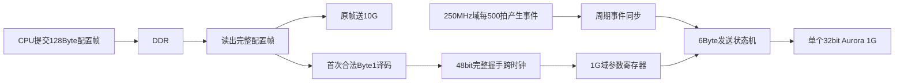

# 设计DDR乒乓传输方案

<!-- codex-history-md-export {"combined_sha256": "bffca1155c5e39418cc6b72cfa183a8ae0f545e99ed18bec2cafe520c08f5e0e", "format_version": 4, "kind": "conversation", "project_name": "PCIE-CPU", "session_ids": ["01a0936e-635f-7952-b5c4-b891d6cf3004"], "storage_mode": "session", "theme_key": "session-e89b6b3b507da1b8f346", "theme_title": "设计DDR乒乓传输方案"} -->

* Project：PCIE-CPU
* 创建时间：2026-09-13 20:15:22 +0800
* 最后更新时间：2026-09-13 20:15:27 +0800

## 对话内容

### User

### Assistant

我会先读取两份需求文档、本地工程记录及远程连接信息，核对现有代码和仿真覆盖，再梳理 DDR 缓冲与 PCIe 地址递增方案。当前处于计划模式，本轮先形成可直接实施的设计和代码修改计划，暂不修改工程。

两份文档已读到。新文档写了“2µs 周期发送并解析命令”，我会以你本次要求为准，按“有完整帧就透传、暂不解析低 3 字节”设计。另外，V1.0 正文写的是“100µs/1KB”，与你提到的 50µs 不同，需要以当前代码确认实际基线。远程 Windows 主机已连通。

现有工程已接入 DDR，但业务窗口仍只有 64KiB，上下行各 32KiB；当前桥接按固定 512Byte 帧处理，上行每完成一帧就通知 CPU，还没有 100ms 多帧乒乓管理。已有验证记录主要是 DDR 冒烟和接口编译，不能视为新需求已覆盖。

乒乓控制可以沿用 PCIe 方案里的“起始地址、长度、CPU 读完确认”：每 100ms 封存一块并通知 CPU，同时往另一块继续写。建议保留读完确认，避免异常时覆盖软件尚未读完的数据。

需求已明确：下行每帧复制到 10G、1G 两路；上行只接收 10G；固定 128Byte，按 50µs 一帧估算。这样每 100ms 是 2,000 帧、256,000Byte，建议每个 DDR 乒乓区分配 256KiB，双区合计 512KiB。片上 BRAM 方案仅做资源分析，不实施替换。

### User

板上ddr信息，可以参考当前的历史project记录E:\codex\_history\_md\PCIE-CPU\2026-08-20\_09-08\_完善 adapter 与 pcie.v 设计方案、2026-08-20\_14-02\_集成 ddr\_proc 到 PCIE-CPU.md

### Assistant

我会核对这两份记录中的 DDR 容量、板卡和接口约束。另发现一处需要纳入修改：当前代码在最后一个写数据拍结束时就产生接收完成，文档却写“等待 DDR 写响应后通知”。新方案必须以实际 AXI 写响应完成为准，再发布批次地址和长度。

已确认，本次只做**代码集成、前仿和 Markdown 说明，不做综合、实现或上板**。双路发送遇到反压/掉线时如何处理，等你稍后提供的录音解释文件再定，暂不锁定最终方案。

目前已确定：

- **下行**：固定 128Byte，每帧原样发送到 10G 和 32bit 的 1G 接口，不解析低 3 字节。
- **上行**：只缓存 10G 返回数据；50µs 一帧，每 100ms 约 2,000 帧，共 256,000Byte。
- **DDR**：建议两个 256KiB 乒乓区。每 100ms 切换写入区，CPU 读取上一块；保留 `CPU_REC_STATE` 读完确认。切换按时间触发，不能等 256KiB 写满才切换。
- **PCIe 关系**：继续使用“起始地址＋长度＋中断＋读完确认”；地址在块内每帧递增 128Byte，长度改为这一批完整帧的总字节数。

**片上资源容量够，BRAM 替代仅分析。** KU040 有 600 个 36Kb BRAM；按常规 64bit 存储组织，一个 256KiB 区约需 64 个，双区约 128 个，占全芯片 BRAM 的 **21.3%**。这说明缓存本身可容纳，但整机剩余资源需扣除 XDMA、FIFO、ILA 等，现有旧综合报告不能代表新增设计的实际余量。[AMD 器件资源](https://docs.amd.com/api/khub/documents/dGU6Y~1b8XPqDFk5ulti6g/content)、[BRAM 组织](https://docs.amd.com/r/en-US/ug573-ultrascale-memory-resources/Block-RAM-Summary)

历史记录确认板上是四颗 GDQ3BFAM-WJ，合计 **4GiB、64bit**，DDR 容量充足。当前工程仍使用 Micron 别名配置，这一点会在说明中区分。

代码核查已发现必须处理的内容：

1. 当前仍有固定 512Byte 帧及 64KiB 地址窗口限制。
2. 已有地址递增，但没有 100ms 批次和乒乓管理。
3. 接收完成早于 DDR 写响应完成，需要修正。
4. 仿真 RAM 索引固定为 `[15:3]`，扩容时必须一起修改，否则高地址会发生别名。
5. 旧仿真覆盖 512Byte 基础闭环，尚未覆盖本次双路下发、128Byte 多帧及乒乓切换。

当前尚未修改代码或新增文档；待录音补齐最后一项行为约定后，再形成完整可实施计划。

我会先读取专家确认记录，并核对本地 DDR 工程备份的完整性和与已检查远程版本的关系。本轮不连接远程机、不跑仿真；当前仍在计划模式，先明确本地修改方案和目标副本。

录音把两件事分得更清楚了：10G 下行主要是启停、参数等“写一次、转发一次”；1G 则讨论了“配置一次，由 FPGA 每 2µs 持续产生模拟量数据”。这与之前确认的“两路原样复制每一帧”有实质区别，不能直接当成同一种发送逻辑。

上行讨论最后倾向“先做双区乒乓”，并建议把缓存周期放宽到 200～500ms；录音也明确区分了“通知 CPU 来取”与“直接 DMA 写入 CPU 内存”。我会保留这些区别，不把讨论中的建议自动当成已经定稿的需求。

收到，主机侧只例化一个 Aurora 1G 模块。我会读取 Buck 接口说明，确认它对主机发送接口的要求；从机 Buck 模型和算法不纳入本地工程修改。

明白，主机侧只新增 **一个 32bit Aurora 1G 实例**，不加入 Buck 模型、PWM 或算法计算。按此前明确要求，主机负责帧转发，上行只缓存 10G 数据。

Buck 文档确认：

- **2µs** 是从机模型内部计算步长，不能据此要求 CPU 每 2µs 下发一帧。
- **50µs** 是 `vout_valid` 输出间隔。
- `vout` 为 32bit，但这是模型结果位宽，不等于通信帧长度；此前约定的 **128Byte 固定帧**仍保留。

刚完成只读检查：

- XPR 的 100 条直接文件引用均存在。
- 备份清单没有缺失文件；仅一份运行记录 MD 与原清单不同。
- RTL、BD、XCI、约束和仿真源码均保留，没有 bitstream。
- 本地另有 1G 源码，但封装接口比上轮检查的远程 `_verified` 版本旧，不能直接认定完全一致。

建议后续从该备份建立独立本地开发副本，保留原备份。上行周期等你确认，先不改成 500ms。当前仍处于计划模式，尚未修改文件；本轮没有 SSH 连接，也没有运行仿真。

### User

buck模型是属于子机的内容，我主机不需要关注。现在的意思大致是每次上电只配一次。然后它配完之后会传到主机当中。解析的话，你看是在从收到DDR数据开始解析，还是说已经想要往aurora 1G或10G口转发的时候再解析比较好。这个时候需要看新加需求.docx  说明了帧格式，默认第零 byte 是传到10G口，但是这个主机可以透传因为子机会进行解析。然后，但是重点是第一 byte是属于1G口的内容。 128 byte 它其实只有两个有效的 byte，第零 byte 传给给10G口，第一 byte 是传给1G，并且它尽管每帧都会有，但实际上它作为它的配置，其实它的每一次上电之后，它传给主机的第一 byte 是固定的，这个值大约就是1到10吧，就是对应我刚才传的buck文档里，它1到10会对应解析出一个16比特+一个32比特，加起来是6个 byte。这6个 byte 的数据需要传给子机。然后这个 Word 里的 input 就是我们主机给子机的数据，然后 output 是子机输出的，不需要关心。只需要关心主机侧的行为即可                        另外，1g口只做下行，只有下行通路，效果是首次配完之后，理论上它是每两微秒就会把模拟量就是我们解析出来的这个六个 Byte，会发给那个子机。当然这个 input 信号也要按那个文档进行添加。然后呢，上行是没有1g口的，然后上行就是通过aurora 10g口进行转发。所以说之前的双路透传可能要更改一次，我理解下行1g口是不需要轮询的，一有数据就去解析它那个第一 Byte，目前约定它不会动态地变，所以说只要它来一个 Byte，便是有效的，就解析一次接口，解析一次之后就每两微秒给主机发送，主机的aurora 1g 口发送即可就行。另外我理解是这个万一 aurora 反压怎么办？我理解不管，如果它反压我就下一个两微秒再发出去，我不更改我的发送间隔。你看一下这个，我这个想法是否合理。

### Assistant

我会按这个新定义调整下行方案：10G 保留原帧透传，1G 改为“首次配置译码后，每 2µs 发送一次固定参数”。我先核对 1G 的发送握手和 Buck 输入字段，重点判断反压时怎样既保持周期基准，又不发出半帧。

这里有一个必须区分的地方：`duty` 和 `Vin` 正好是 6Byte，但 Word 还列了 `model_en` 等控制输入。`clk`、`rst` 不能简单按端口逐项通过 Aurora 传过去；需要约定哪些由从机本地产生、哪些通过命令控制。我建议 1G 只周期发送这 6Byte 参数，启停继续由 10G 命令控制。

**这个思路合理：1G 应改成“配置译码＋周期发送”，不再与 10G 做双路原帧透传。** 但反压处理需要保证已经开始的帧完整发送。

**解析位置建议放在 DDR 读出之后、两路发送之前。**

具体流程：

1. CPU 将完整 128Byte 写入 DDR，再通过现有完成寄存器提交。
2. FPGA 读取该帧，在首个有效读数据拍提取 **Byte1，即小端顺序的 `[15:8]`**。
3. 首次收到合法编号 `1～10`，查表得到 `duty[15:0]` 和 `Vin[31:0]`，锁存配置。
4. 完整 128Byte 仍原样送往 10G；Byte0 由从机解析。
5. 1G 使用锁存的参数独立周期发送，不再反复读 DDR，也不等待新的 CPU 数据。

这样配置解析不会被 10G 的发送反压拖住。首次配置后，重复编号忽略；其他编号也不更新，重新配置需要主机逻辑复位。非法编号不启动发送。

映射直接采用 Buck 文档中的十组输入，`Vin` 使用文档规定的定点数 `电压×1048576`，不传浮点数。

**1G 每帧只发 6Byte：`duty＋Vin`。**

建议约定字节顺序为：

| 字节 | 内容 |
|---|---|
| 0～1 | `duty`，小端 |
| 2～5 | `Vin`，小端 |

32bit 接口分两拍发送：第一拍 4Byte，第二拍 2Byte并结束帧。`model_en`、时钟、复位等由从机自行控制，主机不添加这些 Buck 信号。

**“反压就等下一次 2µs”只能用于尚未提交的发送任务。**

一旦向 IP 拉高 `valid`，就必须保持当前拍的数据、有效信号和帧尾信息，直到 `ready` 握手；不能撤销，也不能丢掉半帧。[Aurora 发送规则](https://docs.amd.com/r/en-US/pg046-aurora-8b10b/Transmitting-Data)、[AXI Stream 握手要求](https://documentation-service.arm.com/static/642583d7314e245d086bc8c9?token=)

建议采用：

- **2µs 定时器始终运行，不因反压重新计时。**
- 到周期点，发送器空闲且配置有效，就提交一帧。
- 上一帧仍在发送，跳过本周期的新任务，不累计补发。
- 已提交的帧遇到反压，保持当前拍，恢复后继续完成。
- 完成后等待下一个周期点，再发送下一帧。

因为参数始终相同，跳过重复发送任务比较合适，也不会反压 CPU 或 10G。需要明确：**固定的是发送调度周期；发生反压时，无法同时保证实际帧间隔仍严格为 2µs。**

还有一个时钟细节：1G 用户时钟是 31.25MHz，2µs 对应 **62.5 拍**。不能简单固定计数 62 或 63；建议使用现有 250MHz 域每 500 拍产生周期事件，再同步到 1G 域，接受用户时钟带来的量化偏差。

这些下行要求现在已经明确。上行仍只走 10G→DDR→CPU，乒乓批次周期保留待你确认。本轮只做方案确认，没有修改工程或运行仿真。

### User

现在是计划模式，你要 先列出计划然后执行。  AURORA 1g内部没有这种60秒每秒对应的周期的话，那还能转发吗？因为它是31.25m，这种能转发吗？做跨时钟可以吗？

### User

现在是计划模式，你要 先列出计划然后执行。  AURORA 1g内部没有这种对应的周期的话，那还能转发吗？因为它是31.25m，这种能转发吗？做跨时钟可以吗？

### User

现在是计划模式，你要 先列出计划然后执行。  AURORA 1g内部没有这种对应的周期的话，那还能转发吗？因为它是31.25m，这种能转发吗？做跨时钟可以吗？       另外分析一下录音转写文件中，关于上行通路如何进行ddr存取什么方案最优？500ms还是分块管理（可能需要额外寄存器？逻辑改动大吗？工作量多少）

### Assistant

我会先列清三部分：1G 的 2µs 调度与跨时钟方案、上行 DDR 的乒乓/分块比较、对应的代码和寄存器改动。当前仍是计划模式，我会完成只读分析并给出实施计划；切换到执行模式后再修改本地工程，仿真继续延后。

1G 可以发送，不需要 IP 内部提供 2µs 定时功能。31.25MHz 每拍是 32ns，6Byte 只需两个 32bit 数据拍；周期由外部逻辑控制。跨时钟也可行：把首次译码得到的 48bit 配置用完整握手送到 1G 时钟域，再同步周期事件。不能把 250MHz 域的一拍脉冲直接接过去，否则可能漏掉。

上行的关键不是“500ms 或分块”二选一，而是分别确定**多久形成一个可读块、允许积压多少块**。按录音提出的软件响应抖动问题，我更推荐固定大小的多块循环缓存：

| 方案 | 实际数据/块 | 分配空间 | 第一块发布后，到必须复用它的时间* |
|---|---:|---:|---:|
| 500ms × 2块 | 1,280,000Byte | 2 × 2MiB | 约500ms |
| 100ms × 2块 | 256,000Byte | 2 × 256KiB | 约100ms |
| 100ms × 8块 | 256,000Byte | 8 × 256KiB | 约700ms |
| 12.5ms × 64块 | 32,000Byte | 64 × 32KiB | 约787.5ms |

\* 假设开始时其他块空闲、按周期连续接收；已有积压会缩短余量，CPU 的响应和 DMA 搬运必须一起计入。

“100ms × 8块”比“500ms × 2块”更早提供数据，占用 DDR 更少，又能吸收更长的短时软件停顿。12.5ms 小块则增加通知、DMA 和验证次数，目前收益不大。录音中“250点约1KB”按4Byte/点计算；按你现在规定的128Byte/帧，应改为32,000Byte。

多块管理不必推翻 PCIe 交互：仍由原来的地址/长度寄存器指向最老的完整块，CPU DMA 读完后确认一次，硬件再呈现下一块。增加写块号、读块号、完成块计数和每块长度即可。建议另加3个只读诊断寄存器，显示积压块数、当前批次序号、丢帧数，旧寄存器偏移保持不变。

从现有代码出发，帧长修改、写响应确认、DDR 地址扩容和仿真地址截断修正，是两种方案都要做的。8块循环比双区额外增加的是队列管理与满队列/回绕验证，属于中等改动；粗估熟悉该工程的工程师多需约1～2人日，完整仿真和软件联调另计。两种方案都不能保证软件无限停顿时不丢数据，缓存满时应保护未读块，并明确记录丢弃的新帧。

<proposed_plan>
# 本地工程修改计划：1G 周期发送与上行 DDR 八块缓存

## 1. 确定方案与执行范围

- 主机只新增一个 **32bit Aurora 1G 实例**。1G 只做业务下行；不例化 Buck 模型，不处理其输出或启停信号。
- 下行：CPU 的128Byte配置帧原样送10G；Byte1首次译码后，1G独立周期发送6Byte参数。
- 上行：只接收10G，采用已确认的 **100ms × 8块循环缓存**。
- 本次实施完成代码、工程引用、验证源码和说明文档；只做静态检查，仿真延后，不运行综合、实现或上板。暂不连接、同步远程机。

当前仍为计划模式；以下修改在切换到执行模式后实施。

## 2. 1G 配置、周期与跨时钟

**31.25MHz 完全能够发送这6Byte数据，IP本身不需要提供2µs定时器。** 每拍32ns，6Byte需要两个32bit有效数据拍；每2µs发送6Byte，业务负载仅24Mb/s。实际发送还包含成帧、CRC和时钟补偿开销，不能把两拍等同于线路总耗时。[Aurora发送接口](https://docs.amd.com/r/en-US/pg046-aurora-8b10b/Transmitting-Data)

实施数据流：

- CPU完成DDR写入并提交命令后，FPGA读取帧；提取Byte1，即小端数据中的 `[15:8]`，解析不依赖10G发送完成。
- 将编号1～10按Buck文档映射为 `duty[15:0]`、`Vin[31:0]`；`Vin`使用电压乘以1048576的定点整数。
- 首次合法配置锁存至主机逻辑复位。后续配置帧继续走10G，但不改变已锁存的1G参数；非法编号不启动1G发送。
- 48bit参数通过完整握手跨时钟，禁止逐bit独立同步。仅同步一次配置，周期发送不重复读DDR。[XPM握手同步器](https://docs.amd.com/api/khub/documents/jmiFdx9l8KRrBT6exVnb1Q/content)
- 1G载荷固定为：Byte0～1是小端 `duty`，Byte2～5是小端 `Vin`。按现有封装的有效字节位置装配两拍，第二拍仅2Byte有效并结束帧。
- 250MHz域每500拍产生一次周期事件，采用翻转事件同步到1G域，不能直接同步4ns脉冲。周期启动于配置传递完成之后。
- 1G发送时刻受32ns时钟粒度限制，因此不承诺每次线路发送恰好间隔2000ns；周期基准保持2µs、不累计漂移。
- 空闲时响应周期事件；忙时跳过新的重复发送任务，不补发、不排长队。已拉高有效信号的拍必须保持至握手完成。
- 链路掉线时停止新发送并清理未完成帧；保留已配置参数，重新建立链路后恢复周期发送，不补发停机期间的数据。
- 保留1G IP的既有Duplex配置和建链所需物理连接，业务RX输出不进入DDR。按其配置提供25MHz初始化时钟。

## 3. 上行 DDR：100ms × 8块

录音中的核心顾虑是软件响应抖动。**块周期决定数据等待多久才能读取，块数量决定能吸收多少积压，两者应独立设计。**

| 项目 | 500ms双区乒乓 | 本次100ms八块 |
|---|---:|---:|
| 每块帧数，按50µs/帧 | 10,000 | 2,000 |
| 每块有效数据 | 1,280,000Byte | 256,000Byte |
| 每块分配空间 | 2MiB | 256KiB |
| 总分配空间 | 4MiB | 2MiB |
| 正常通知频率 | 2次/秒 | 10次/秒 |
| 空缓存起步，首块发布后的复用余量 | 约500ms | 约700ms |

八块方案更早提供数据，也能吸收更长的短时停顿。上述余量包括软件响应和DMA读取时间；有积压时会减少，不能保证软件无限停顿仍不丢数据。

**地址和存取规则：**

- 保留下行窗口 `0x00008000～0x0000FFFF`，容量32KiB。
- 上行窗口使用 `0x00100000～0x002FFFFF`，划分8个256KiB块。
- 第 `k` 块第 `n` 帧地址为 `0x00100000 + k×0x40000 + n×128`。
- XDMA和CONV_DMA的DDR映射扩展为低4MiB；仿真RAM容量、索引位宽一起扩展，消除当前 `[15:3]` 截断造成的高地址别名。
- 每100ms封存一块，记录实际完整帧长度；不等256KiB写满才封存。定时边界遇到在途帧，完成该帧及写响应后再封存，不拆帧。
- 只有最后一个相关AXI写响应成功返回，才能向CPU发布该块。修正当前在末个数据拍就产生完成通知的问题。
- CPU按先后顺序读取完整块；读取期间该块内容、地址和长度保持不变。
- 空周期不产生数据中断。超容量、队列满或异常时，不覆盖未读块；继续接收并按完整帧丢弃新数据，记录丢帧。
- 软件释放空间后，从后续完整帧恢复记录；持续处理能力必须大于平均2.56MB/s，并有追赶积压的余量。

只维护8个块的状态和长度、读写块号及计数，不引入动态内存分配或通用描述符链表。

## 4. PCIe接口与代码改动

保留现有软件基本流程：

**中断 → 读取地址/长度 → C2H搬运 → 写读完确认 → 获取下一块。**

- `0x18/0x1C`：呈现最老完整块的地址和有效长度，保持至CPU确认。
- `0x14 CPU_REC_STATE`：保留0→1确认方式，一次确认释放一个块。
- `0x10 INT_STATE`：读清只清通知，不释放数据；确认后若还有完整块，重新通知，处理同拍清除与新事件竞争。
- `0x08 BUF_LEN_MAX`：更新为上行单块容量256KiB；下行仍限制32KiB，在新版协议说明中明确区分，并更新版本号。
- 新增3个只读寄存器：`0x30`完整待取块数、`0x34`当前呈现块的批次序号、`0x38`累计丢帧数。
- 下行提交寄存器偏移保持不变；将128Byte帧长贯穿地址检查、FDMA长度、计数和帧边界逻辑。

修改集中在发送/接收桥、adapter、CONV_DMA、寄存器模块、TOP/PCIe集成及DDR仿真模型。新增1G配置译码、跨时钟及周期发送模块和上行块管理模块，关键寄存器及握手信号添加中文解释。

本地1G封装早于远程 `_verified` 版本，实施时统一接口并记录来源；远程恢复后再比对，不声称两份版本完全一致。

相较双区乒乓，八块方案主要多出队列管理、状态展示和回绕/积压测试。粗估熟悉工程的工程师增加约1～2人日，属于规划估算；完整仿真、工具问题和软件联调另计。

## 5. 验证与说明文档

本地先检查工程引用、位宽、地址范围、参数一致性和改动清单，编写但暂不运行以下测试：

- 十组配置映射、非法/重复配置、48bit跨时钟一致性、6Byte字节顺序。
- 2µs周期事件、忙时跳过、首拍/末拍反压保持、链路恢复。
- 连续至少三轮八块回绕，逐帧核对数据、地址、长度和顺序。
- 延迟/错误写响应不得提前发布成功块；CPU并发读取时数据不变。
- CPU延迟响应、积压排空、队列满、丢帧计数及恢复。
- 高地址不别名、跨4KiB边界批量DMA、IRQ读清与读完确认竞争。
- 后续分别运行模块前仿和真实XDMA Root Port集成仿真，不用旧512Byte结果代替新需求验收。

新增Markdown文档，包含总体设计、状态与关键时序、寄存器及CPU操作、V1.0需求与当前代码/仿真覆盖对照、录音决策解释和待运行测试清单。

BRAM仅作分析：原100ms双区约需128个36Kb块；本次八块共2MiB，按常规64bit组织约需512个，占KU040全部600个的85.3%，会明显挤压其他模块空间。因此本次继续使用板上DDR，不实施BRAM替代。
</proposed_plan>

---

<!-- codex-history-md-export-append {"append_id": "118ddec9e54c003e71ad8689", "dialogue_sha256": "393e1a544a13d708a518fb80a827fecfaf45f8b222f4324f98d9cff776affa6f", "from_message": 22, "session_id": "01a0936e-635f-7952-b5c4-b891d6cf3004", "to_message": 67} -->

## 对话增量

### User

PLEASE IMPLEMENT THIS PLAN:
# 本地工程修改计划：1G 周期发送与上行 DDR 八块缓存

## 1. 确定方案与执行范围

- 主机只新增一个 **32bit Aurora 1G 实例**。1G 只做业务下行；不例化 Buck 模型，不处理其输出或启停信号。
- 下行：CPU 的128Byte配置帧原样送10G；Byte1首次译码后，1G独立周期发送6Byte参数。
- 上行：只接收10G，采用已确认的 **100ms × 8块循环缓存**。
- 本次实施完成代码、工程引用、验证源码和说明文档；只做静态检查，仿真延后，不运行综合、实现或上板。暂不连接、同步远程机。

当前仍为计划模式；以下修改在切换到执行模式后实施。

## 2. 1G 配置、周期与跨时钟

**31.25MHz 完全能够发送这6Byte数据，IP本身不需要提供2µs定时器。** 每拍32ns，6Byte需要两个32bit有效数据拍；每2µs发送6Byte，业务负载仅24Mb/s。实际发送还包含成帧、CRC和时钟补偿开销，不能把两拍等同于线路总耗时。[Aurora发送接口](https://docs.amd.com/r/en-US/pg046-aurora-8b10b/Transmitting-Data)

实施数据流：

- CPU完成DDR写入并提交命令后，FPGA读取帧；提取Byte1，即小端数据中的 `[15:8]`，解析不依赖10G发送完成。
- 将编号1～10按Buck文档映射为 `duty[15:0]`、`Vin[31:0]`；`Vin`使用电压乘以1048576的定点整数。
- 首次合法配置锁存至主机逻辑复位。后续配置帧继续走10G，但不改变已锁存的1G参数；非法编号不启动1G发送。
- 48bit参数通过完整握手跨时钟，禁止逐bit独立同步。仅同步一次配置，周期发送不重复读DDR。[XPM握手同步器](https://docs.amd.com/api/khub/documents/jmiFdx9l8KRrBT6exVnb1Q/content)
- 1G载荷固定为：Byte0～1是小端 `duty`，Byte2～5是小端 `Vin`。按现有封装的有效字节位置装配两拍，第二拍仅2Byte有效并结束帧。
- 250MHz域每500拍产生一次周期事件，采用翻转事件同步到1G域，不能直接同步4ns脉冲。周期启动于配置传递完成之后。
- 1G发送时刻受32ns时钟粒度限制，因此不承诺每次线路发送恰好间隔2000ns；周期基准保持2µs、不累计漂移。
- 空闲时响应周期事件；忙时跳过新的重复发送任务，不补发、不排长队。已拉高有效信号的拍必须保持至握手完成。
- 链路掉线时停止新发送并清理未完成帧；保留已配置参数，重新建立链路后恢复周期发送，不补发停机期间的数据。
- 保留1G IP的既有Duplex配置和建链所需物理连接，业务RX输出不进入DDR。按其配置提供25MHz初始化时钟。

## 3. 上行 DDR：100ms × 8块

录音中的核心顾虑是软件响应抖动。**块周期决定数据等待多久才能读取，块数量决定能吸收多少积压，两者应独立设计。**

| 项目 | 500ms双区乒乓 | 本次100ms八块 |
|---|---:|---:|
| 每块帧数，按50µs/帧 | 10,000 | 2,000 |
| 每块有效数据 | 1,280,000Byte | 256,000Byte |
| 每块分配空间 | 2MiB | 256KiB |
| 总分配空间 | 4MiB | 2MiB |
| 正常通知频率 | 2次/秒 | 10次/秒 |
| 空缓存起步，首块发布后的复用余量 | 约500ms | 约700ms |

八块方案更早提供数据，也能吸收更长的短时停顿。上述余量包括软件响应和DMA读取时间；有积压时会减少，不能保证软件无限停顿仍不丢数据。

**地址和存取规则：**

- 保留下行窗口 `0x00008000～0x0000FFFF`，容量32KiB。
- 上行窗口使用 `0x00100000～0x002FFFFF`，划分8个256KiB块。
- 第 `k` 块第 `n` 帧地址为 `0x00100000 + k×0x40000 + n×128`。
- XDMA和CONV_DMA的DDR映射扩展为低4MiB；仿真RAM容量、索引位宽一起扩展，消除当前 `[15:3]` 截断造成的高地址别名。
- 每100ms封存一块，记录实际完整帧长度；不等256KiB写满才封存。定时边界遇到在途帧，完成该帧及写响应后再封存，不拆帧。
- 只有最后一个相关AXI写响应成功返回，才能向CPU发布该块。修正当前在末个数据拍就产生完成通知的问题。
- CPU按先后顺序读取完整块；读取期间该块内容、地址和长度保持不变。
- 空周期不产生数据中断。超容量、队列满或异常时，不覆盖未读块；继续接收并按完整帧丢弃新数据，记录丢帧。
- 软件释放空间后，从后续完整帧恢复记录；持续处理能力必须大于平均2.56MB/s，并有追赶积压的余量。

只维护8个块的状态和长度、读写块号及计数，不引入动态内存分配或通用描述符链表。

## 4. PCIe接口与代码改动

保留现有软件基本流程：

**中断 → 读取地址/长度 → C2H搬运 → 写读完确认 → 获取下一块。**

- `0x18/0x1C`：呈现最老完整块的地址和有效长度，保持至CPU确认。
- `0x14 CPU_REC_STATE`：保留0→1确认方式，一次确认释放一个块。
- `0x10 INT_STATE`：读清只清通知，不释放数据；确认后若还有完整块，重新通知，处理同拍清除与新事件竞争。
- `0x08 BUF_LEN_MAX`：更新为上行单块容量256KiB；下行仍限制32KiB，在新版协议说明中明确区分，并更新版本号。
- 新增3个只读寄存器：`0x30`完整待取块数、`0x34`当前呈现块的批次序号、`0x38`累计丢帧数。
- 下行提交寄存器偏移保持不变；将128Byte帧长贯穿地址检查、FDMA长度、计数和帧边界逻辑。

修改集中在发送/接收桥、adapter、CONV_DMA、寄存器模块、TOP/PCIe集成及DDR仿真模型。新增1G配置译码、跨时钟及周期发送模块和上行块管理模块，关键寄存器及握手信号添加中文解释。

本地1G封装早于远程 `_verified` 版本，实施时统一接口并记录来源；远程恢复后再比对，不声称两份版本完全一致。

相较双区乒乓，八块方案主要多出队列管理、状态展示和回绕/积压测试。粗估熟悉工程的工程师增加约1～2人日，属于规划估算；完整仿真、工具问题和软件联调另计。

## 5. 验证与说明文档

本地先检查工程引用、位宽、地址范围、参数一致性和改动清单，编写但暂不运行以下测试：

- 十组配置映射、非法/重复配置、48bit跨时钟一致性、6Byte字节顺序。
- 2µs周期事件、忙时跳过、首拍/末拍反压保持、链路恢复。
- 连续至少三轮八块回绕，逐帧核对数据、地址、长度和顺序。
- 延迟/错误写响应不得提前发布成功块；CPU并发读取时数据不变。
- CPU延迟响应、积压排空、队列满、丢帧计数及恢复。
- 高地址不别名、跨4KiB边界批量DMA、IRQ读清与读完确认竞争。
- 后续分别运行模块前仿和真实XDMA Root Port集成仿真，不用旧512Byte结果代替新需求验收。

新增Markdown文档，包含总体设计、状态与关键时序、寄存器及CPU操作、V1.0需求与当前代码/仿真覆盖对照、录音决策解释和待运行测试清单。

BRAM仅作分析：原100ms双区约需128个36Kb块；本次八块共2MiB，按常规64bit组织约需512个，占KU040全部600个的85.3%，会明显挤压其他模块空间。因此本次继续使用板上DDR，不实施BRAM替代。

### Assistant

我开始在独立本地开发副本中实施，保留原备份。先完成128Byte数据通路、DDR八块管理和1G周期发送，再更新工程引用、验证源码与说明文档；本轮不连接远程机，也不运行仿真或综合。

### User

你现在使用的RRR1G是哪个目录下的。

### Assistant

本次使用的本地 Aurora 1G 源文件来自：

- 封装：[E:\aurora_proc\rtl\aurora_8b10b_1p25g_design.v](E:/aurora_proc/rtl/aurora_8b10b_1p25g_design.v)
- IP 配置：[E:\aurora_proc\archive_work\aurora_8b10b_1p25g.xci](E:/aurora_proc/archive_work/aurora_8b10b_1p25g.xci)
- 接口转换模块：`E:\aurora_proc\archive_work\1g`

开发副本正在复制。我会先处理与1G来源无关的 DDR 和 PCIe 改动：把数据拍完成与写响应完成分开，并让八块缓存只向CPU提供已完整写入的块。原备份和本地 Aurora 源目录都不会被修改。

### User

先按顶层设计，不例化aurora在top模块中  先实现其余逻辑

### Assistant

收到，本轮按 Aurora 用户接口边界实现：`TOP` 引出1G/10G的数据、握手、用户时钟和状态端口，不在其中例化 Aurora IP。先完成配置译码、1G周期发送、10G透传、DDR八块管理和PCIe交互；IP、GT引脚及初始化时钟留到后续接入。

已加入三个独立模块：1G首次配置与周期发送、10G完整帧跨时钟缓存、DDR八块写入管理。接下来接入现有 adapter 和 PCIe，同时修正 AXI 写响应判定。按你的最新要求，TOP只保留Aurora用户接口，不接入任何Aurora IP。

### User

尽管这一步不做验证，但是你把验证的前方的防抖方案，包括就是连板扫描的可能会增加的那个模块都给我写上。但是这个应该不用再增加新的，就是连板测试模块了吧。前方的代码也行，但是它本来工程就有防抖代码，是吧。你看是不是防抖代码不用动，还是更改一下比较好。如果需要更改的话，你把防抖代码给我更改。然后只不过不用先跑。另外所有修改后的设计和验证代码必须按照之前的代码规范，就是代码规范是在一盘的那个 Central OS 那个目录下。然后去详细地标注注释新写的这些代码。

### Assistant

我会把验证源码和后续联板测试需要的接口一起补齐，暂不运行，并先检查现有验证逻辑能否复用。你提到的“防抖”可能是转写中的“仿真”；我会结合工程内容核对，避免误改真正的按键防抖逻辑。新增和修改代码也会按你指定的规范补充详细注释。

### User

继续

### Assistant

已找到规范目录 `E:\centOS\代码规则建立\代码规范输出`，包括 RTL、SystemVerilog 验证规范和自定义规则。工程也已有快速功能仿真和真实 XDMA Root Port 两套环境；我会优先改造现有环境，新增模块只补必要的定向测试，不额外加入常驻设计的联板测试模块。

规范要求 CDC、FIFO 等优先使用平台封装，所以我会调整新增代码中的跨时钟实现，并把配置锁存、复位恢复、反压保持、块释放与中断竞争的条件写清楚。规范的批准单元登记表目前仍有 TBD 项；我会记录这一限制，继续完成 FPGA 本地实现，不把它标成已完成签核。

### User

E:\centOS\代码规则建立\代码规范输出

### Assistant

收到，已确认就是这个目录，正在按其中的 RTL、验证代码及自定义规则修改和补注释；本轮仍只准备源码，不运行仿真或联板测试。

现有 Root Port 冒烟用例正在改为 128Byte 帧和新版寄存器地址，并保留真实 XDMA 数据路径。另会补上 1G 配置/反压测试及八块缓存回绕/积压测试。旧的 512Byte 仿真结果只作为历史记录，不能用于证明这次修改通过。

源码检查发现两处需要一起修正：AXI 交叉开关的地址译码也要从 64KiB 扩到 4MiB；丢帧粘滞标志应由“新增丢帧”置位，避免软件读清后被历史累计值再次置位。这两项已纳入修改，接下来继续整理工程引用和验证入口。

目前在主机业务源码中未找到独立的按键消抖模块；已有的是复位同步和跨时钟同步，它们不能当作按键防抖。结合你的上下文，我先按“前仿源码和联板测试准备”继续处理，保留现有硬件复位用途。新增测试还会检查高地址不别名、跨 4KiB 拆分和延迟写响应。

已补齐三类定向前仿源码，并增加完整帧 FIFO 的满载、畸形帧和恢复用例；原快速环境也已改为八块缓存回绕场景。当前正在检查端口、工程文件引用和旧参数残留，并整理设计说明及待运行清单。

### User

继续

### Assistant

继续收尾：我会先复核按寄存器拆分后是否保留原有优先级，再检查测试源码、工程引用和说明文档的一致性。本轮仍只做本地源码与静态检查，不运行仿真、不连接远程机。

核心源码的静态检查未发现多寄存器时序块、wire 声明赋值或参数自引用；本轮修改涉及的五个主工程源文件，其原备份哈希也保持一致。设计和测试说明已落盘，正在做最后一轮引用检查。这些结果只代表源码静态检查，不代表仿真通过。

我会先核实远程 SSH 目标、已验证的 Aurora 1G 接口，以及这份 V2.00 文档与当前代码的差异。当前已切换到计划模式，本轮先做只读检查，明确同步和远程集成方案；暂不上传或修改远程工程。文档中的方案会作为待评审参考，不直接覆盖你已确认的需求。

SSH 已确认连接到 `DESKTOP-H0AB0MD`，DDR 工程和 verified 1G 目录都存在。V2.00 的八块缓存和地址规划与此前方案一致，但确认寄存器自动清零、批次序号和丢帧计数的定义与本地代码有差异，需要统一后再同步。

建议采用 **V2 的硬件自动清零握手**，但需要修订几处细节；它与当前代码并非完全一致，不能直接当作已实现协议。

| 项目 | 当前本地代码 | V2 文档 | 影响与建议 |
|---|---|---|---|
| 上行读完确认 `0x14` | 检测软件写入的 0→1 边沿；下次确认需先写0 | 软件写1，硬件消费后自动清0 | 推荐V2，软件更简单；必须保证一次写入只释放一块 |
| 下行提交 `0x20` | 内部提交寄存器保持写入值，但读回来自另一条状态信号 | 提交后保持1，完成后清0 | 推荐统一成V2，避免“读回已是0，内部仍是1，下一次写1不能触发”的问题 |
| 下行完成时刻 | 当前逻辑涉及10G发送完成 | 文档描述DDR读取/接收完成 | 建议本轮保持到整批10G末拍握手完成才清0，软件含义清晰，也便于控制连续提交 |
| 批次序号 `0x34` | 每100ms递增，空窗口也计数 | 每发布一个非空块递增 | 推荐V2；连续块号便于检查重复读取，不能用它单独判断丢帧 |
| 丢帧计数 `0x38` | 包含缓存丢弃及部分异常，计数存在回绕 | 主要统计完整帧因缓存不足被丢弃，建议饱和 | 推荐饱和；需明确异常帧是否计入，避免软件误解 |

采用V2主要修改寄存器握手、adapter控制和对应测试，**不用重做八块DDR管理，也不需要为自动清零新增软件可见寄存器**。软件需要同步更新，不能认为寄存器偏移不变就完全兼容。下行批量提交也应明确为本轮支持：长度为128Byte整数倍，且不超过32KiB窗口。

你补充的Buck边界已明确：**主机只发送6Byte参数，不发送Buck的其他输入、启停或输出信号。** Aurora自身的有效、帧尾、握手信号仍用于接口传输，不计入这6Byte载荷。

远程1G将采用：

其接口已确认是32bit。建议继续用两拍发送，载荷顺序为：

`duty低字节、duty高字节、Vin的4个小端字节`

需要特别注意：**该封装的末拍有效字节位于高位端**。因此直接接这个封装时，第二拍使用高16bit，`tx_rem=1`、`tx_eof=1`。你举的“低16bit有效”可以通过适配实现，但既然位位置由主机决定，直接遵循现有封装更合适，线上仍然只有6Byte。

远程运行前仿的范围也已确认：包含模块测试及XDMA集成回归，不包含综合、实现或上板。目前仍受计划模式限制，已完成SSH与源码只读核查，尚未上传或修改远程工程。

### User

继续生成新plan啊，采用你认可的寄存器交互方案（兼顾可靠性与软硬件交互的简洁性），同时注意上行链路子机传来的64bit的数据永久是高32bit为无效数据，只需要向DDR存放低32bit即可

### Assistant

我会把寄存器方案统一为硬件自动清零握手，并将上行增加为“每个64bit有效数据拍只保留低32bit，再紧凑写入DDR”。先核对现有帧边界和计数，确认这会如何影响DDR中的帧长、块长度及软件读取规则。

1G 改为在31.25MHz用户时钟域每63拍触发一次，周期就是2.016µs，这样可以去掉250MHz域的周期事件跨时钟，只保留首次6Byte配置的握手跨时钟。

上行也可以先按64bit接口透传，到DDR写入前再提取低32bit并紧凑拼接；我倾向于这个方案，帧边界检查和数据压缩职责更清楚。还需明确“16Byte”是线路帧长还是去掉无效高32bit后的有效长度，否则DDR地址步长会差一倍。

<proposed_plan>
# 远程工程集成计划：16Byte下行、1G独立周期发送、上行有效数据流缓存

## 1. 最终数据格式与处理方式

本轮按最新要求替换此前128Byte方案：

| 通路 | 处理规则 |
|---|---|
| CPU→10G→子机 | 每个下行配置帧16Byte，主机原样透传；支持一次提交多个完整帧 |
| CPU配置→1G→子机 | 首次合法Byte1译码，独立发送6Byte参数；不发送Buck其他信号 |
| 子机→10G→DDR | 每个有效64bit拍只保存低32bit；DDR连续存放有效数据，不要求上行固定帧长 |
| DDR→CPU | 每100ms封存一块，CPU按实际有效长度读取并确认释放 |

**上行采用有效数据流模型。** Aurora封装继续处理线路成帧，业务缓存层依据接收有效信号收集低32bit，不再用“必须收到若干拍”决定是否存储。DDR不保存SOF/EOF，也不保留线路帧边界；软件按连续32bit数据序列处理。

如果未来软件需要按线路帧恢复数据，需另行增加帧长度或标记；本轮不引入这些元数据。

## 2. 远程同步与Aurora集成

- 以已确认连接的 `DESKTOP-H0AB0MD` 为目标，对原备份、本地开发和远程现状进行三方比较，保留远程新增修改。
- 核对1G与10G的GT通道、参考时钟和约束，保留1G建链需要的物理RX连接，1G业务RX不进入DDR。
- 更新BD模块引用、低4MiB地址映射和工程路径，重新生成所需IP/BD输出，避免继续使用手改但未再生成的缓存文件。

### 1G发送

- 在31.25MHz用户时钟域每63拍产生一次发送机会，名义周期 **2.016µs**；删除原250MHz域500拍定时及周期事件跨时钟。
- 首次合法Byte1对应的48bit参数仍通过完整握手跨时钟，配置保持至主机逻辑复位。
- 6Byte载荷为小端`duty[15:0]`和`Vin[31:0]`，使用现有十组映射。
- 按verified封装发两拍：第一拍4Byte，第二拍高16bit为剩余2Byte，`REM=1`并结束帧。
- 忙时跳过新的周期任务；已经发起的有效拍保持至握手完成。链路恢复后继续按周期发送，不补发历史任务。
- 2.016µs是发送机会间隔；反压或掉线时，实际成功发送间隔可能超过3µs。

## 3. 上行DDR：先透传、写入前压缩

### 接收与压缩

- 10G接收端先将每个有效64bit拍送入异步FIFO，不按固定线路帧长组帧。
- DDR域取出数据后丢弃高32bit，按到达顺序紧凑拼接：
  `DDR写拍 = {后到的低32bit, 先到的低32bit}`。
- 不存无效高32bit，不在DDR中为其保留空洞。每个接收有效拍贡献4Byte有效长度。
- 当前接口约定有效拍的低32bit始终完整有效；高32bit的数值不参与合法性判断。
- FIFO满时继续消费线路输入，丢弃无法保存的32bit有效数据字并计数，不覆盖已缓存数据。

### 八块管理

- 保留100ms×8块，每块256KiB，上行地址仍为`0x00100000～0x002FFFFF`。
- 封存按DDR域100ms窗口进行，不等待线路EOF。边界到达后停止给当前块追加新数据，完成在途写事务再发布。
- 若封存时仅剩一个32bit数据字，发起低4Byte有效的64bit写拍，`WSTRB=8'h0F`；有效长度只增加4Byte。
- 将尾拍字节使能贯穿FDMA和AXI写通路；常规完整写拍为`WSTRB=8'hFF`。
- 只有成功写响应对应的数据才计入有效长度。写失败的数据计为丢失，后续写入从尚未提交的位置继续，避免CPU读取无效空洞。
- 空窗口不发布；块满后丢弃该窗口后续新数据，等待下一窗口。八块全部待取时不覆盖旧块。
- FIFO中的积压数据按实际进入DDR写窗口归属，块序号不代表精确采样时间。
- 实际有效长度为4Byte整数倍；不再沿用“每100ms固定2000个128Byte帧”的容量计算。

## 4. 寄存器与CPU交互

采用自动清零门铃，寄存器偏移保持不变；由于上行格式及统计单位改变，协议版本标为 **V2.01**，RTL版本值沿用工程编码方式更新为`0x00002001`。

| 偏移 | 最终语义 |
|---|---|
| `0x08` | 上行单块容量，固定`0x40000` |
| `0x10` | 通知状态，读清；不释放DDR数据 |
| `0x14` | CPU完成C2H后写1，硬件消费一次并清0 |
| `0x18/0x1C` | 最老待取块地址及实际有效字节数，确认前稳定 |
| `0x20` | 下行提交门铃：写1提交，整批10G末拍握手完成后清0 |
| `0x24/0x28` | 下行地址及长度；地址16Byte对齐，长度为16Byte整数倍，限制在32KiB下行窗口内 |
| `0x30` | 完整待取块数，0～8 |
| `0x34` | 非空块发布序号，每成功发布一块递增 |
| `0x38` | 累计丢失的**32bit有效数据字数**，32bit饱和计数 |

- `0x38`改名为`UP_DROP_WORD_CNT`。上行不再识别固定业务帧，因此不能继续称“丢帧数”；不额外增加寄存器。
- 丢失计数覆盖FIFO溢出、缓存无法接收及DDR写失败，按数据字计数，不重复统计。
- `0x14`一次有效写1最多释放一个当前队头；空队列确认不释放同拍新发布块。
- `0x20`提交时锁存地址和长度，忙期间重复写1不重复启动；软件等待清0再提交下一批。非法提交不访问DDR，消费后清0，软件须先检查地址和长度。
- 新队头通知优先于旧通知读清，避免并发确认导致中断丢失。
- CPU使用单一队列消费者：读通知→读取地址/长度→完成C2H→写确认。下行先完成H2C，再写提交门铃。
- V2.00 DOCX作为评审参考，另写V2.01 Markdown协议及差异说明，不直接覆盖原Word。

## 5. 验证、规范与交付

按 `E:\centOS\代码规则建立\代码规范输出` 修改设计和验证代码，补齐中文接口、时序、计数单位、复位及异常处理注释。

在远程执行前仿，分模块通过后运行XDMA集成回归：

- 16Byte下行单帧、批量提交、Byte1首次译码、非法及重复配置。
- 1G十组6Byte参数、字节顺序、63拍周期、首末拍反压、忙时跳过及链路恢复。
- 上行高32bit随机变化但DDR结果不变；连续、间断接收及不同线路帧边界。
- 偶数/奇数数据字封存，尾拍`WSTRB`、有效长度与CPU读取逐字一致。
- 至少三轮八块回绕，积压、全满、释放恢复及饱和计数。
- 延迟或错误写响应不提前发布；高地址不别名，跨4KiB传输正确。
- 门铃连续提交与自动清零、空队列确认、IRQ读清与发布竞争。
- 更新旧测试中的128Byte假设、版本日期和计数口径，不以旧仿真结果作为验收依据。

交付远程开发工程、同步清单、设计与寄存器说明、测试源码和实际前仿报告。本轮不运行综合、实现或上板；仍在计划模式时仅开展只读核查。
</proposed_plan>

### User

PLEASE IMPLEMENT THIS PLAN:
# 远程工程集成计划：16Byte下行、1G独立周期发送、上行有效数据流缓存

## 1. 最终数据格式与处理方式

本轮按最新要求替换此前128Byte方案：

| 通路 | 处理规则 |
|---|---|
| CPU→10G→子机 | 每个下行配置帧16Byte，主机原样透传；支持一次提交多个完整帧 |
| CPU配置→1G→子机 | 首次合法Byte1译码，独立发送6Byte参数；不发送Buck其他信号 |
| 子机→10G→DDR | 每个有效64bit拍只保存低32bit；DDR连续存放有效数据，不要求上行固定帧长 |
| DDR→CPU | 每100ms封存一块，CPU按实际有效长度读取并确认释放 |

**上行采用有效数据流模型。** Aurora封装继续处理线路成帧，业务缓存层依据接收有效信号收集低32bit，不再用“必须收到若干拍”决定是否存储。DDR不保存SOF/EOF，也不保留线路帧边界；软件按连续32bit数据序列处理。

如果未来软件需要按线路帧恢复数据，需另行增加帧长度或标记；本轮不引入这些元数据。

## 2. 远程同步与Aurora集成

- 以已确认连接的 `DESKTOP-H0AB0MD` 为目标，对原备份、本地开发和远程现状进行三方比较，保留远程新增修改。
- 核对1G与10G的GT通道、参考时钟和约束，保留1G建链需要的物理RX连接，1G业务RX不进入DDR。
- 更新BD模块引用、低4MiB地址映射和工程路径，重新生成所需IP/BD输出，避免继续使用手改但未再生成的缓存文件。

### 1G发送

- 在31.25MHz用户时钟域每63拍产生一次发送机会，名义周期 **2.016µs**；删除原250MHz域500拍定时及周期事件跨时钟。
- 首次合法Byte1对应的48bit参数仍通过完整握手跨时钟，配置保持至主机逻辑复位。
- 6Byte载荷为小端`duty[15:0]`和`Vin[31:0]`，使用现有十组映射。
- 按verified封装发两拍：第一拍4Byte，第二拍高16bit为剩余2Byte，`REM=1`并结束帧。
- 忙时跳过新的周期任务；已经发起的有效拍保持至握手完成。链路恢复后继续按周期发送，不补发历史任务。
- 2.016µs是发送机会间隔；反压或掉线时，实际成功发送间隔可能超过3µs。

## 3. 上行DDR：先透传、写入前压缩

### 接收与压缩

- 10G接收端先将每个有效64bit拍送入异步FIFO，不按固定线路帧长组帧。
- DDR域取出数据后丢弃高32bit，按到达顺序紧凑拼接：
  `DDR写拍 = {后到的低32bit, 先到的低32bit}`。
- 不存无效高32bit，不在DDR中为其保留空洞。每个接收有效拍贡献4Byte有效长度。
- 当前接口约定有效拍的低32bit始终完整有效；高32bit的数值不参与合法性判断。
- FIFO满时继续消费线路输入，丢弃无法保存的32bit有效数据字并计数，不覆盖已缓存数据。

### 八块管理

- 保留100ms×8块，每块256KiB，上行地址仍为`0x00100000～0x002FFFFF`。
- 封存按DDR域100ms窗口进行，不等待线路EOF。边界到达后停止给当前块追加新数据，完成在途写事务再发布。
- 若封存时仅剩一个32bit数据字，发起低4Byte有效的64bit写拍，`WSTRB=8'h0F`；有效长度只增加4Byte。
- 将尾拍字节使能贯穿FDMA和AXI写通路；常规完整写拍为`WSTRB=8'hFF`。
- 只有成功写响应对应的数据才计入有效长度。写失败的数据计为丢失，后续写入从尚未提交的位置继续，避免CPU读取无效空洞。
- 空窗口不发布；块满后丢弃该窗口后续新数据，等待下一窗口。八块全部待取时不覆盖旧块。
- FIFO中的积压数据按实际进入DDR写窗口归属，块序号不代表精确采样时间。
- 实际有效长度为4Byte整数倍；不再沿用“每100ms固定2000个128Byte帧”的容量计算。

## 4. 寄存器与CPU交互

采用自动清零门铃，寄存器偏移保持不变；由于上行格式及统计单位改变，协议版本标为 **V2.01**，RTL版本值沿用工程编码方式更新为`0x00002001`。

| 偏移 | 最终语义 |
|---|---|
| `0x08` | 上行单块容量，固定`0x40000` |
| `0x10` | 通知状态，读清；不释放DDR数据 |
| `0x14` | CPU完成C2H后写1，硬件消费一次并清0 |
| `0x18/0x1C` | 最老待取块地址及实际有效字节数，确认前稳定 |
| `0x20` | 下行提交门铃：写1提交，整批10G末拍握手完成后清0 |
| `0x24/0x28` | 下行地址及长度；地址16Byte对齐，长度为16Byte整数倍，限制在32KiB下行窗口内 |
| `0x30` | 完整待取块数，0～8 |
| `0x34` | 非空块发布序号，每成功发布一块递增 |
| `0x38` | 累计丢失的**32bit有效数据字数**，32bit饱和计数 |

- `0x38`改名为`UP_DROP_WORD_CNT`。上行不再识别固定业务帧，因此不能继续称“丢帧数”；不额外增加寄存器。
- 丢失计数覆盖FIFO溢出、缓存无法接收及DDR写失败，按数据字计数，不重复统计。
- `0x14`一次有效写1最多释放一个当前队头；空队列确认不释放同拍新发布块。
- `0x20`提交时锁存地址和长度，忙期间重复写1不重复启动；软件等待清0再提交下一批。非法提交不访问DDR，消费后清0，软件须先检查地址和长度。
- 新队头通知优先于旧通知读清，避免并发确认导致中断丢失。
- CPU使用单一队列消费者：读通知→读取地址/长度→完成C2H→写确认。下行先完成H2C，再写提交门铃。
- V2.00 DOCX作为评审参考，另写V2.01 Markdown协议及差异说明，不直接覆盖原Word。

## 5. 验证、规范与交付

按 `E:\centOS\代码规则建立\代码规范输出` 修改设计和验证代码，补齐中文接口、时序、计数单位、复位及异常处理注释。

在远程执行前仿，分模块通过后运行XDMA集成回归：

- 16Byte下行单帧、批量提交、Byte1首次译码、非法及重复配置。
- 1G十组6Byte参数、字节顺序、63拍周期、首末拍反压、忙时跳过及链路恢复。
- 上行高32bit随机变化但DDR结果不变；连续、间断接收及不同线路帧边界。
- 偶数/奇数数据字封存，尾拍`WSTRB`、有效长度与CPU读取逐字一致。
- 至少三轮八块回绕，积压、全满、释放恢复及饱和计数。
- 延迟或错误写响应不提前发布；高地址不别名，跨4KiB传输正确。
- 门铃连续提交与自动清零、空队列确认、IRQ读清与发布竞争。
- 更新旧测试中的128Byte假设、版本日期和计数口径，不以旧仿真结果作为验收依据。

交付远程开发工程、同步清单、设计与寄存器说明、测试源码和实际前仿报告。本轮不运行综合、实现或上板；仍在计划模式时仅开展只读核查。

### Assistant

开始实施。我先做三方差异核对并建立远程独立开发工程，随后修改数据通路和寄存器、集成单个1G模块，最后在远程运行前仿。原工程和本地备份会保留。

当前本地接收逻辑仍按16个64bit拍组帧，需要改成逐拍FIFO，并在DDR域压缩。寄存器核对也确认了一个问题：下行状态读回清零后，内部提交位仍可能保持1，导致下一次写1无法触发；本轮会统一这两处状态。

1G周期已改到用户时钟域的63拍计时。上行缓存代码已改为64bit逐拍跨域，DDR写入端提取低32bit，并支持窗口末尾单个数据字的4Byte写使能。接下来贯通adapter、FDMA和BD端口，再更新验证用例；这些改动目前尚未通过仿真。

### User

继续

### Assistant

继续接通16Byte下行、上行压缩写入和自动清零门铃。我会先检查上次中断时的文件与远程复制状态，再继续修改，避免重复执行脚本。

远程独立开发目录已建立。三方比较中，已改源码与远程没有内容冲突，只有XPR工程文件存在差异，需要单独合并引用。顶层已加入单个verified 1G封装并恢复10G连接；新的上行测试正在覆盖奇偶字数封存、八块回绕和延迟写响应。

### User

<send_user_message_question_reply>
[{"questionItemId":"[\"request_user_input_async\",\"call_PH6pdHtvxFczNyH2vlFlT0OR\",0]","question":"远程没有个人规则指定的 D:\\Xilinx_2020_2\\Vivado\\2020.2\\bin\\vivado.bat，已确认实际安装位于 C:\\Xilinx\\Vivado\\2020.2\\bin\\vivado.bat。是否允许本次远程前仿和BD生成使用这个已安装的2020.2版本？这是现有固定路径规则与远程安装路径的冲突；源码修改和同步会继续。","answer":"允许远程使用 C:\\Xilinx\\Vivado\\2020.2"}]
</send_user_message_question_reply>

### Assistant

已收到远程Vivado路径授权，本轮将使用 `C:\Xilinx\Vivado\2020.2`。先运行1G周期发送和上行块管理的独立前仿，定位问题后再运行DDR/PCIe集成回归。

1G独立前仿已通过：十组配置共完成60次发送，覆盖了6Byte字节顺序、2.016µs周期、重复配置、首末拍反压及掉线恢复。接下来验证上行压缩与八块队列，并刷新主工程BD。

上行块管理前仿已通过，包括三轮八块回绕、单字尾拍、队列满丢字、延迟写响应和写错误恢复。FIFO前仿发现原有XPM可编程满/空阈值不符合2020.2约束，我会修正后重跑；BD刷新也尚未通过，正在定位模块引用问题。

### User

继续

### Assistant

继续。我先收取正在运行的FIFO、AXI和BD处理结果，再完成真实寄存器握手测试与XDMA集成回归。

目前确认通过的是1G发送和上行块管理两项。FIFO容量测试与AXI测试还未通过：前者需要核对FWFT模式下的实际可缓存拍数，后者出现超时，我已加入事务状态诊断。不会把Vivado退出码为0当作测试通过，必须同时检查PASS标记和错误日志。

AXI前仿和真实寄存器前仿已通过。AXI超时来自测试平台时钟声明顺序，修正后八个高地址块读写、跨4KiB传输及错误响应检查均通过。寄存器测试确认了自动清零、连续提交、忙时重复提交忽略，以及忙期间地址和长度保持。

五项独立前仿现已全部通过：1G发送、上行块管理、接收FIFO、AXI读写和真实寄存器。BD模块引用也已成功刷新，新增端口及4MiB地址映射通过BD校验。现在补齐IP仿真输出并准备XDMA Root Port回归；整工程联调尚未完成。

---

<!-- codex-history-md-export-append {"append_id": "8a32245dba160b7e4f788cc8", "dialogue_sha256": "f3dbac70d640a7c1c9834c58d5c314d9e56510ad3419c2f22772a9a2e770d12d", "from_message": 67, "session_id": "01a0936e-635f-7952-b5c4-b891d6cf3004", "to_message": 78} -->

## 对话增量

### Assistant

已核对两路Aurora参考时钟：1G使用125MHz、AF6/AF5，10G使用156.25MHz、T6/T5，来自不同GT参考时钟位置。IP仿真输出生成还在处理依赖；同时会把远程Vivado重新生成的BD接口回收到本地，避免本地保留旧端口定义。

### User

### Assistant

可以保持Vivado窗口打开。不过我更新工程引用或BD时，GUI可能还保留旧状态；这期间请先不要保存工程或启动综合，等我同步完成后重新打开工程，避免覆盖新引用。

### User

我已关闭工程，继续剩余操作，已经做好的仿真不需要重新进行

### Assistant

收到。已通过的模块仿真不重复运行；接下来补齐工程/IP引用、完成尚未执行的集成验证，并检查清理开发目录中的旧工程文件。

两个 register slice XCI 已保留。核查还发现，当前工程没有登记部分新业务 RTL 和 Aurora 封装引用，正在用 Vivado Tcl 补齐。此前模块仿真直接加载源码，因此通过结果仍有效，但不能据此证明顶层依赖完整。

已取回原有仿真日志，确认 1G、八块缓存、AXI、接收 FIFO、寄存器五组均有 PASS 记录。现在生成的是补齐后 IP 的仿真依赖文件，没有重跑这些测试。随后只执行尚未完成的 XDMA Root Port 集成验证。

1G IP 和两个 register slice 的仿真输出已生成。生成脚本随后遇到“嵌套 IP 只能由父 IP 生成”的限制，我已修正脚本，跳过单独生成嵌套 IP；这是工程生成步骤的问题，不是已通过的模块仿真失败。

工程引用修复已完成，Vivado 源码依赖报告中的缺失实例列表为空。XDMA Root Port 集成前仿已启动；它将检查真实 PCIe/XDMA、寄存器、DDR 与业务接口之间的闭环。

另外补了一个独立的尾拍专项用例：通过实际 CONV_DMA 和 RAM 检查 `WSTRB=0F` 是否只更新低四字节、保留高四字节。它补充此前未验证的端到端行为，不重跑原 AXI 回归。

---

<!-- codex-history-md-export-append {"append_id": "0e976a319d06b6bdc9be320c", "dialogue_sha256": "de7fb176eab7bb12ef40b7bee255091f8401525b193424e6638aa6f7925db178", "from_message": 78, "session_id": "01a0936e-635f-7952-b5c4-b891d6cf3004", "to_message": 110} -->

## 对话增量

### User

继续

### Assistant

尾拍专项已通过，确认 `WSTRB=0F` 能贯穿 CONV_DMA，且高四字节保持不变。集成前仿目前卡在 Vivado 2020.2 的 `util_ds_buf` 仿真源码与原语接口不匹配；我会先修复这项依赖，再继续未通过的集成验证，已通过的测试不重跑。

### User

记录调试过程的所有命令、问题、过程、依赖到md文档，后续同步维护

### Assistant

我会建立持续追加的调试记录，记录执行命令、报错、定位依据、修复、依赖路径和验证结果，并同步到远程工程。已有过程会依据本地脚本和日志补录；无法完整还原的命令会明确标注，后续每一步继续维护。

调试记录已建立并开始同步到远程，后续命令会自动追加命令文本、退出码和输出。当前兼容性问题位于 KU040 不使用的 GTME5 分支；将仅修正导出的仿真源码并保存原文件，保留实际使用的 GTE3 路径和生产 XCI。

`util_ds_buf` 的兼容修复后，VHDL 编译已通过。首次编译中止时 Vivado 尚未生成展开脚本，因此接下来从展开阶段继续；这次遇到的报错和处理命令也已写入调试记录。

继续展开时又发现 Vivado 2020.2 的分步启动脚本缺少内部状态，尚未进入 RTL 展开。我会改为先一次性导出编译、展开和运行脚本，再按顺序执行，并在每步检查错误日志。这个工具脚本问题也已记录，避免后续重复排查。

记录文件已同步到远程开发工程的 `docs/远程V2.01_调试过程与命令记录.md`，本地也保留同名副本。你补入的两个 XCI 也已取回本地开发副本，避免后续同步遗漏；原备份保持不动。

当前已完成旧文件归档，并在核对本地与远程关键 RTL 的 SHA-256，确保同步内容一致。新增尾拍测试后，50 个设计与验证文件的语法检查通过；集成测试正在使用强制刷新的导出文件重新编译。

13 个关键 RTL 的本地/远程哈希全部一致。强制刷新后，集成编译已通过，正在展开真实 XDMA 模型。命令记录工具也已放入工程的 `scripts/record_debug_command.py`，便于后续继续追加并同步调试文档。

集成展开目前停留在 XSim 的静态优化阶段，暂未产生新的错误，也尚未进入功能仿真，因此还不能报告集成通过。已完成的测试结果、哈希核对和归档清单都已保存；展开结果会继续追加到同一份调试文档。

旧快速验证源码中的 128Byte 假设也已更新为 V2.01：下行 16Byte，上行压缩低32bit，并贯通写字节使能。更新后语法检查通过，功能结果仍标为“未运行”，没有重跑既有测试。集成展开还在进行，当前没有新增报错。

我正在把本次确认有效的工程生成步骤固化到脚本中，重点是强制更新 BD 仿真导出、正确处理带空格的路径，以及跳过嵌套 IP 的单独生成。这样后续重新生成工程时，可以复用已排查过的流程；相关原因和依赖也会同步记入文档。

刚才同步脚本时，远程 SSH 连接超时了；因此目前无法确认集成展开是否仍在运行，也不能报告通过。我会检查连接恢复情况，并先在本地记录最后已确认的状态和待同步文件，避免遗漏。

- 已通过的测试未重跑；新增尾拍专项通过。
- 旧工程文件已归档，13个关键RTL同步哈希一致。
- 集成编译通过，展开期间SSH失联，最终结果未知。

此前记录已同步远程；断线后的最新记录保存在本地，待连接恢复后补同步并接续检查。

### User

已恢复SSH，继续 当前已完成什么，计划完成什么，另外现在综合报错

### Assistant

我先只读核查恢复后的 SSH、上次集成仿真日志和最新综合报错，再给你列出已完成项、剩余工作及修复计划。当前处于计划模式，暂不修改工程或启动综合。

已定位综合首个根因：下行改为 16Byte 后，TX FIFO 的 `PROG_FULL_THRESH` 变成了 510，但当前 XPM 配置只允许 7～507。后面的 adapter、PCIe、TOP 失败都是由它连带引起的，与两个 register slice XCI 缺失无关。

上次集成仿真的最终日志也已查到：展开失败于 `util_ds_buf` 包装层与实体端口不一致。之前的补丁从旧备份重建了实体，导致新包装层的端口缺失；这项修复需要调整，不能继续套用旧备份。

<proposed_plan>
# V2.01 当前进度与后续修复计划

## 已完成

- 已实现16Byte批量下行、首次Byte1配置锁存、单个32bit Aurora 1G周期发送，以及上行低32bit压缩和100ms×8块DDR缓存。
- V2.01寄存器、门铃自动清零、写响应后发布数据、尾拍字节使能已接入。
- 六组模块前仿通过：1G、块管理、AXI、接收FIFO、寄存器、`WSTRB=0F`尾拍专项。旧快速测试已更新，但未重新运行。
- 已整理工程引用、归档旧工程文件，并建立持续维护的调试MD。
- 今日只读核查确认：你运行的1G、两个register slice、CONV_DMA、INFO_EXCH独立综合均成功。**顶层综合尚未通过，完整集成前仿也尚未通过。**

## 两项已确认问题

**顶层综合：TX FIFO阈值越界。**

16Byte对应2个64bit拍，旧公式 `512-BURST_WORDS` 得到510；当前XPM允许范围为7～507。随后adapter、PCIe、TOP的报错属于连带失败，不是两个XCI仍然缺失。

**集成展开：`util_ds_buf`版本混用。**

断线后最终日志显示，新包装层需要的 `BUFG_PS_I/O` 等端口在实体中不存在。此前兼容补丁从旧备份恢复实体，破坏了强制刷新后的版本一致性，需要修正。

## 下一步实施

1. **修复TX FIFO**
   - 阈值改为 `512-max(BURST_WORDS,8)`，当前为504，保留至少8拍余量。
   - 保持现有整次读突发的空间检查；补充参数合法性检查，更新遗留128Byte注释。

2. **修复仿真依赖**
   - 从当前BD重新导出匹配的包装层和实体。
   - 停止无条件套用旧备份；兼容补丁以当前导出文件为基础，仅处理已确认不兼容的未使用分支，并核对版本、端口和原文件哈希。
   - 保留真实XDMA模型，不用占位模块替代集成验收。

3. **补齐同步与记录**
   - 先比较断线后本地与远程差异，保留你新增的修改。
   - 补同步未完成的工程脚本和说明文档。
   - 将本次只读核查命令、综合根因、修复过程和实际结果追加到调试MD，同时更新哈希及待办清单。

## 验证与交付边界

- 新增或执行受影响的TX定向前仿：16Byte单帧、批量提交、FIFO接近满、持续反压和恢复，检查无溢出、漏拍或重复拍。
- 修复依赖后继续Root Port集成前仿，检查H2C、16Byte下行、低32bit上行压缩、C2H、IRQ及门铃确认；必须取得PASS且无错误，不能只看退出码。
- 已通过且未受影响的六组模块测试不重跑。
- **按你刚才选择：我完成代码修复及前仿，综合由你手动运行；不执行实现或上板。**
- 接口和寄存器协议继续使用V2.01，本次不新增寄存器或改变业务格式。
</proposed_plan>

### User

好，我知道了，注意补充代码注释，修复代码规范（if（xx）换行+语句、两个always间换行、assign语句要加注释），补充一个md文档介绍整体设计/验证架构与各设计/验证模块的作用

### Assistant

已纳入计划，作为独立交付项：

- **代码注释与规范**：按现有规范目录检查本轮新增、修改的设计及验证代码。`if/else` 后换行书写语句，两个 `always` 块之间留空行；每条 `assign` 补充中文注释，说明含义及必要的时钟域、握手或边界条件。第三方 IP 自动生成代码保留原样。
- **架构说明文档**：新增 `docs/V2.01_整体设计与验证架构.md`，包含整体数据流、时钟与复位关系、DDR块管理、CPU交互流程，以及各设计模块和验证模块的职责、连接关系。
- **验证边界**：文档明确区分真实RTL、IP、行为RAM、BFM、监视器和计分板，列出已通过、未运行及待解决项目，避免把模块通过等同于整机通过。
- **检查方式**：格式和注释调整后检查差异及语法；功能修复运行受影响前仿，不重复运行无关已通过测试。

当前仍为计划模式，尚未开始这些修改。

### User

重新生成计划

### Assistant

<proposed_plan>
# V2.01 工程修复、规范整理与架构文档计划

## 1. 当前基线与实施范围

已完成16Byte批量下行、单个32bit Aurora 1G周期发送、上行低32bit压缩、100ms×8块DDR缓存及V2.01寄存器交互。六组模块前仿已通过；完整Root Port集成前仿和顶层综合尚未通过。

本轮不改变数据格式、寄存器偏移或协议版本。由我完成代码修复和前仿，**综合由用户手动运行，不执行实现或上板**。

## 2. 功能及工程依赖修复

- **TX FIFO综合错误**：将可编程满阈值从 `512-BURST_WORDS` 改为 `512-max(BURST_WORDS,8)`；当前16Byte帧对应阈值504，满足XPM允许的7～507范围。检查整次读突发的空间预留，补充参数合法性检查及中文说明。
- **`util_ds_buf`集成展开错误**：从当前BD强制导出匹配的包装层和实体，取消从旧备份无条件恢复实体的做法。优先使用匹配的生成文件；确需兼容调整时，仅处理已确认不兼容的未使用分支，并保留当前文件备份、哈希和变更记录。
- **工程脚本**：统一带空格路径的Tcl参数处理、父子IP生成范围及BD仿真导出步骤。兼容补丁重复执行不得叠加修改；输入版本或预期内容不符时明确报错。
- **同步交付**：补齐断线期间未成功同步的脚本、源码和文档，重新核对关键文件哈希。保留用户补入的两个register slice XCI。

## 3. 中文注释与代码规范

依据 `E:\centOS\代码规则建立\代码规范输出`，整理本轮新增、修改的设计和验证代码：

- `if/else` 条件与执行语句分行书写，多语句分支使用 `begin/end`，不保留同行条件加赋值的写法。
- 相邻两个 `always` 块之间留空行，保持缩进及代码段分隔一致。
- 每条 `assign` 添加中文注释，说明信号含义；涉及跨时钟、握手、字节顺序、计数单位和异常条件时明确解释。
- 补充模块职责、接口方向、所属时钟域、复位行为、状态转换、反压和丢弃策略。
- 清理残留的128Byte帧、按帧丢弃、旧周期及旧寄存器语义注释。

格式整理与功能修复分别检查差异，避免夹带逻辑变化。第三方原始IP代码及自动生成文件不做批量格式化；必要兼容修改单独记录。

## 4. 整体设计与验证架构文档

新增 `docs/V2.01_整体设计与验证架构.md`，包含：

- **总体架构图**：CPU/XDMA、寄存器、adapter、DDR、10G和单个1G之间的数据流与控制流。
- **时钟和复位**：各时钟域、配置握手跨域、接收异步FIFO、1G初始化及链路恢复关系。
- **业务时序**：下行批量提交、首次配置锁存、63拍发送机会、上行压缩、块封存、写响应提交和CPU确认释放。
- **设计模块说明表**：逐个说明本轮相关模块的文件、职责、主要接口、上下游及异常处理；明确主机不包含Buck模型。
- **验证架构图与模块表**：说明各测试顶层、接口、驱动/BFM、监视器、计分板、行为RAM及真实XDMA模型的作用，明确哪些路径使用真实RTL、哪些使用模型。
- **需求与验证对应表**：列出已通过、未运行、修复中及不在本轮范围内的项目，并给出日志和脚本入口。

继续维护调试过程MD，追加命令、问题、定位依据、修复、依赖及实际结果；历史失败记录保留，不用成功结果覆盖。

## 5. 验证与验收

- **规范及静态检查**：检查格式、注释、工程引用、参数范围和语法；确认纯格式修改未改变逻辑。
- **受影响TX前仿**：验证16Byte单帧、批量提交、FIFO接近满、持续反压和恢复，检查阈值合法且无溢出、漏拍、重复拍。
- **集成前仿**：修复依赖后继续真实XDMA Root Port验证，检查H2C、下行透传、上行低32bit压缩、DDR/C2H、IRQ和门铃确认。以PASS及无错误日志为准，不能仅凭退出码。
- **已有结果保留**：不重跑未受影响且已通过的六组模块测试；若功能修复影响其中某项，仅重跑对应测试并说明原因。
- **交付条件**：源码和文档同步一致、规范检查完成、受影响前仿通过、集成结果如实记录，并提供用户手动综合的工程入口和检查要点。未通过项目明确列出，不宣称整机验收完成。
</proposed_plan>

### User

PLEASE IMPLEMENT THIS PLAN:
# V2.01 工程修复、规范整理与架构文档计划

## 1. 当前基线与实施范围

已完成16Byte批量下行、单个32bit Aurora 1G周期发送、上行低32bit压缩、100ms×8块DDR缓存及V2.01寄存器交互。六组模块前仿已通过；完整Root Port集成前仿和顶层综合尚未通过。

本轮不改变数据格式、寄存器偏移或协议版本。由我完成代码修复和前仿，**综合由用户手动运行，不执行实现或上板**。

## 2. 功能及工程依赖修复

- **TX FIFO综合错误**：将可编程满阈值从 `512-BURST_WORDS` 改为 `512-max(BURST_WORDS,8)`；当前16Byte帧对应阈值504，满足XPM允许的7～507范围。检查整次读突发的空间预留，补充参数合法性检查及中文说明。
- **`util_ds_buf`集成展开错误**：从当前BD强制导出匹配的包装层和实体，取消从旧备份无条件恢复实体的做法。优先使用匹配的生成文件；确需兼容调整时，仅处理已确认不兼容的未使用分支，并保留当前文件备份、哈希和变更记录。
- **工程脚本**：统一带空格路径的Tcl参数处理、父子IP生成范围及BD仿真导出步骤。兼容补丁重复执行不得叠加修改；输入版本或预期内容不符时明确报错。
- **同步交付**：补齐断线期间未成功同步的脚本、源码和文档，重新核对关键文件哈希。保留用户补入的两个register slice XCI。

## 3. 中文注释与代码规范

依据 `E:\centOS\代码规则建立\代码规范输出`，整理本轮新增、修改的设计和验证代码：

- `if/else` 条件与执行语句分行书写，多语句分支使用 `begin/end`，不保留同行条件加赋值的写法。
- 相邻两个 `always` 块之间留空行，保持缩进及代码段分隔一致。
- 每条 `assign` 添加中文注释，说明信号含义；涉及跨时钟、握手、字节顺序、计数单位和异常条件时明确解释。
- 补充模块职责、接口方向、所属时钟域、复位行为、状态转换、反压和丢弃策略。
- 清理残留的128Byte帧、按帧丢弃、旧周期及旧寄存器语义注释。

格式整理与功能修复分别检查差异，避免夹带逻辑变化。第三方原始IP代码及自动生成文件不做批量格式化；必要兼容修改单独记录。

## 4. 整体设计与验证架构文档

新增 `docs/V2.01_整体设计与验证架构.md`，包含：

- **总体架构图**：CPU/XDMA、寄存器、adapter、DDR、10G和单个1G之间的数据流与控制流。
- **时钟和复位**：各时钟域、配置握手跨域、接收异步FIFO、1G初始化及链路恢复关系。
- **业务时序**：下行批量提交、首次配置锁存、63拍发送机会、上行压缩、块封存、写响应提交和CPU确认释放。
- **设计模块说明表**：逐个说明本轮相关模块的文件、职责、主要接口、上下游及异常处理；明确主机不包含Buck模型。
- **验证架构图与模块表**：说明各测试顶层、接口、驱动/BFM、监视器、计分板、行为RAM及真实XDMA模型的作用，明确哪些路径使用真实RTL、哪些使用模型。
- **需求与验证对应表**：列出已通过、未运行、修复中及不在本轮范围内的项目，并给出日志和脚本入口。

继续维护调试过程MD，追加命令、问题、定位依据、修复、依赖及实际结果；历史失败记录保留，不用成功结果覆盖。

## 5. 验证与验收

- **规范及静态检查**：检查格式、注释、工程引用、参数范围和语法；确认纯格式修改未改变逻辑。
- **受影响TX前仿**：验证16Byte单帧、批量提交、FIFO接近满、持续反压和恢复，检查阈值合法且无溢出、漏拍、重复拍。
- **集成前仿**：修复依赖后继续真实XDMA Root Port验证，检查H2C、下行透传、上行低32bit压缩、DDR/C2H、IRQ和门铃确认。以PASS及无错误日志为准，不能仅凭退出码。
- **已有结果保留**：不重跑未受影响且已通过的六组模块测试；若功能修复影响其中某项，仅重跑对应测试并说明原因。
- **交付条件**：源码和文档同步一致、规范检查完成、受影响前仿通过、集成结果如实记录，并提供用户手动综合的工程入口和检查要点。未通过项目明确列出，不宣称整机验收完成。

### Assistant

开始执行。我会先核对远程现状与代码规范，再修复 TX FIFO 阈值和仿真依赖，同时整理注释、补充架构文档。只运行受影响的前仿，综合仍由你手动执行。

核查发现，远程 `.srcs` 中已有包含新端口的 `util_ds_buf` 实体。接下来会让仿真使用它与当前包装层配套编译，移除“从旧备份恢复”的路径；只有编译仍报具体兼容错误时，才做最小修补。

TX 阈值已修复为504，51个设计/验证文件也完成了第一轮格式与注释整理。格式修改前后已逐文件比较非注释词法内容，确认这一轮没有改变逻辑；接下来检查遗漏的同行语句，并补齐关键时序说明。

已新增独立 TX 前仿用例，覆盖单帧、300帧批量传输、FIFO接近满、长时间反压和恢复后的逐拍比对。代码正在同步到远程；同步完成后先跑这个用例，再继续真实 XDMA 集成验证，不重跑无关的六组已通过测试。

### User

远程机子跑用例  快   XDMA验证启动后就可以先暂停   已跑过的所有用例记得附上说明  测的什么、怎么测的、为什么这么测

### Assistant

收到。用例都在远程跑；TX 定向前仿完成后，我会启动 XDMA 集成验证，然后先暂停本轮操作，不等待它跑完。文档会逐项补齐已运行用例的“测什么、怎么测、为什么这样测”和实际结果，并将 XDMA 标明为“已启动、待检查结果”。

TX 定向前仿已通过：单帧峰值占用2拍，300帧批量测试峰值占用504拍；长时间反压后，数据、SOF/EOF和REM检查均通过，没有FIFO溢出或下溢。原有六组测试未重跑。接下来保存说明和检查记录，然后启动 XDMA 集成验证并暂停。
