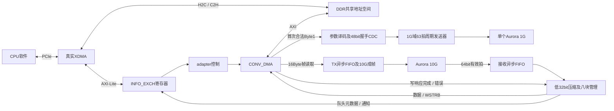
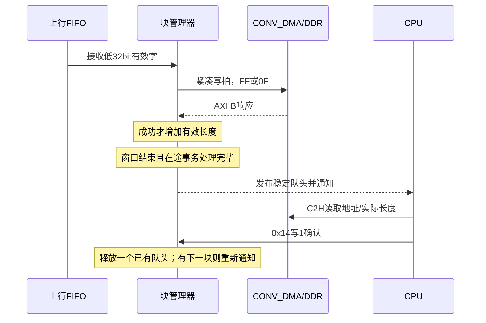
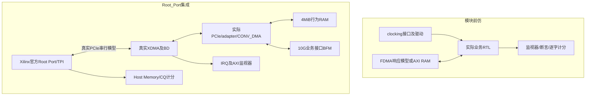

# V2.01 整体设计与验证架构

更新日期：2026-09-20。本文面向接手RTL、验证和CPU软件的工程师。协议以《PCIe交互协议_V2.01.md》为准，测试是否通过以《V2.01_实际验证记录.md》和对应日志为准。工程源码存在、模块前仿通过、完整集成通过、综合通过是不同结论。

## 1. 总体设计

主机不例化Buck模型。CPU下行帧为16Byte，可批量提交；所有帧原样送10G。首次合法Byte1编号配置1G参数，主机只有一个32bit Aurora 1G实例，业务仅下行。上行只来自10G，每个有效64bit拍仅保存低32bit，DDR形成连续小端32bit序列，不保存线路帧边界。

下行窗口为0x8000～0xFFFF，容量32KiB；上行为0x100000～0x2FFFFF，8块，每块0x40000 Byte。XDMA及CONV_DMA映射低4MiB。地址高位不能在仿真RAM中截断为旧64KiB索引。

## 2. 设计模块职责

以下文件路径均相对工程根目录；第三方IP自动生成层不做业务代码格式化。

| 模块 / 文件 | 职责与主要连接 | 边界及异常行为 |
|---|---|---|
| TOP / sources_1/new/TOP.v | 板级端口、时钟复位、PCIe、10G及一个1G封装实例 | 不包含Buck算法；1G业务RX不进入DDR |
| PCIe / sources_1/new/PCIe.v | 连接BD、adapter、1G配置与发送逻辑、DDR后端 | 保留生产接口；仿真包装不代替本模块 |
| design_1 / BD生成层 | XDMA、寄存器AXI-Lite、CONV_DMA、互连及跨时钟桥 | 生成后必须同步ip_user_files，否则新端口可能与旧导出混用 |
| INFO_EXCH | CPU寄存器访问、门铃自动清零、队头元数据展示 | ACK与IRQ读清职责分离；忙时重复下行提交不重复启动 |
| pcie_fdma_aurora_brg_adapter | 下行命令检查、帧地址推进、Byte1观测、上行子模块连接 | 非法下行不访问DDR；丢失统计使用32bit有效字单位 |
| CONV_DMA | FDMA请求转换AXI读写、突发拆分、独立AW/W握手和写响应汇总 | WSTRB贯通；成功写响应到达后才能报告提交完成 |
| fdma_aurora_brg_tx | 一帧一次DDR读突发，经512深度异步FIFO送10G LocalLink | 当前每帧2拍；阈值504，满前预留容量；反压时保持有效拍 |
| RTDS_RX_FRAME_FIFO | 10G用户域64bit原拍跨到DDR域，XPM异步FIFO | 名称保留FRAME但不判断固定帧长；满时丢弃新字并计数 |
| RTDS_RX_BLOCK_WRITER | 丢弃每拍高32bit、两字拼拍、100ms窗口及八块所有权管理 | 单字尾拍WSTRB=0F；成功B响应才计有效长度；不覆盖未确认块 |
| RTDS_1G_PERIODIC_TX | 编号1～10译码、首次配置锁存、1G周期任务和两拍发送 | 非法编号不配置；重复合法帧不改锁存值；忙时跳过，不积压 |
| RTDS_FPGA_CFG_CDC | XPM完整握手传递48bit配置 | 源数据保持到确认，不逐bit独立同步 |
| RTDS_FPGA_COUNT_CDC | 将接收域单步递增计数以Gray结构跨域 | 丢失单位为32bit字；不能用此接口跨任意跳变计数 |
| RTDS_FPGA_BIT_CDC | 单比特状态的XPM平台包装 | 仅用于满足稳定性要求的状态，不直接跨窄脉冲 |
| RTDS_FPGA_RESET_SYNC | 异步置位、目标时钟域同步释放的XPM复位包装 | 时钟未恢复时不提前释放目标域 |
| RTDS_FPGA_1G_INIT | 专用BUFGCE_DIV将100MHz分为25MHz，安排GT与协议核启动复位 | 平台时钟逻辑，不用普通寄存器输出当业务时钟 |
| rtds_ddr4_backend | 选择真实MIG/AXI跨域桥或仿真RAM，并门控初始化完成前的访问 | DDR4_SIM_RAM只用于仿真，不等于真实DDR验证 |
| rtds_axi_ram_model | 4MiB AXI行为RAM，支持字节写使能、读写响应 | 用于协议验证，不模拟DDR物理时序、校准或板级误码 |
| aurora_8b10b_1p25g_design及转换封装 | verified 32bit 1G核与高有效LocalLink业务接口转换 | IP保留Duplex建链连接，主机业务仅使用TX |
| aurora_64b66b_top及example转换层 | 现有10G串行链路、复位与LocalLink封装 | 两个register slice属于依赖，不因业务层BFM通过而可省略 |
| CLK_GEN、TEMP_RD、LED | 系统时钟、温度读数、状态显示等板级辅助 | 不是上行块管理或1G配置协议的一部分 |
| Aurora_frame_gen、Aurora_PCIe_cdc、PCIe_Aurora_cdc、DATA_CDC | 工程保留的历史成帧/跨域辅助源码 | 不作为V2.01新增业务通路的替代入口；是否参与编译以当前TOP依赖为准 |

## 3. 时钟、复位与关键时序

| 域 | 数据及控制 | 跨域方式 |
|---|---|---|
| FDMA/业务域，250MHz | CPU命令、DDR请求、100ms封存、队列元数据、首次配置源端 | 1G配置完整握手；10G数据经异步FIFO |
| 10G用户时钟域 | 下行LocalLink握手、上行有效拍接收 | 数据FIFO；状态/计数经对应平台包装 |
| 1G用户域，31.25MHz | 48bit参数寄存器、63拍机会计数和两拍发送 | 配置握手，不再跨250MHz周期事件 |
| 1G初始化域，25MHz | GT及协议核复位启动 | 专用时钟分频、独立复位同步 |
| MIG/DDR内部域 | 真实DDR校准及AXI访问 | DDR后端的AXI时钟转换，不在业务RTL自行打拍 |

### 下行与1G

CPU先完成H2C，再写地址、长度及0x20提交门铃。地址16Byte对齐，长度为16Byte正整数倍，整批必须位于32KiB下行窗口。硬件锁存提交内容，按16Byte逐帧读取，整批10G末拍握手完成后清门铃。清零说明硬件消费完成，不是子机执行成功回执。

Byte1为小端64bit首拍的[15:8]，解析不等待10G发送完成。首次合法编号映射为duty16和Vin32，Vin采用电压×1048576。参数经过48bit握手到1G域，保持到主机逻辑复位。

1G用户域每63拍产生发送机会，名义2.016µs。载荷顺序为duty低/高字节、Vin低到高四字节。第一拍4Byte，第二拍高16bit放剩余2Byte，REM=1、EOF有效。已经发起的有效拍在反压期间保持；忙时到来的机会跳过。掉线清理未完成发送，保留已配置参数，恢复后不补发历史机会。

### 上行与DDR块

每个10G有效拍贡献一个低32bit字。DDR写拍为{后到的字,先到的字}，无高32bit空洞。100ms到边界后停止追加当前块，完成在途事务；若只有一个字，使用0F字节使能写尾拍，长度只增加4Byte。

写失败的数据计为丢失，下一次从未提交位置继续。空窗口不发布；当前块满或八块全满时不覆盖旧数据，继续消费并丢弃无法存储的新字。0x38为饱和的32bit有效字丢失数，不是帧数。FIFO积压按实际进入DDR窗口归属，批次序号不是精确采样时间戳。

## 4. 验证架构与各模块作用

模块测试目录为regression/batch_1g；接口文件集中声明驱动归属、clocking采样和方向。没有把此次定向测试声称为完整UVM环境。

| 模块测试及接口 | 驱动/模型 | 检查目标与当前状态 |
|---|---|---|
| tb_rtds_1g / rtds_1g_test_if | 配置源、1G ready及链路状态 | 十组映射、非法/重复配置、周期、反压和恢复；2026-09-20 PASS，60帧 |
| tb_rtds_ring / rtds_ring_test_if | FDMA响应模型、按字节记录的参考内存 | 24块回绕、积压、奇偶尾字、延迟/失败响应；2026-09-20 PASS |
| tb_rtds_axi / rtds_axi_test_if | 实际CONV_DMA+RAM，接口层注入AW/W/B停顿 | 高地址不别名、跨4KiB突发、错误响应；2026-09-20 PASS |
| tb_rtds_axi_tail / rtds_axi_tail_test_if | 实际CONV_DMA+RAM，先FF再0F覆盖写 | 低32bit更新、高32bit保持；2026-09-20 PASS，326ns |
| tb_rtds_regs / rtds_regs_test_if | 实际INFO_EXCH及AXI-Lite事务 | 门铃自动清零、忙时提交、确认脉冲、字节使能；2026-09-20 PASS |
| tb_rtds_rx_fifo / rtds_rx_fifo_test_if | 不同线路边界和连续有效拍驱动 | 满时按字丢弃、恢复、XPM阈值；2026-09-20 PASS |
| tb_rtds_tx / rtds_tx_test_if | 实际TX桥及XPM；FDMA响应、LocalLink消费者 | 单帧/300帧、阈值附近占用、长期反压及逐拍数据；2026-09-20 PASS，峰值504拍 |

快速业务环境目录为regression/sim_xdma_trythrough，使用虚拟BAR和内存后端，不证明真实PCIe链路。源码已更新V2.01，本轮没有重跑旧快速回归。

| 快速环境模块 | 作用 |
|---|---|
| tb_xdma_rtds_trythrough | 组织命令、传输和最终结果汇总 |
| rp_api.svh | 虚拟BAR/H2C/C2H任务；不例化INFO_EXCH，不替代真实寄存器测试 |
| xdma_rp_backend | 行为FDMA/Host/Card内存，支持WSTRB；没有真实PCIe协议栈 |
| aurora_ll_peer_bfm | 下行ready停顿，上行低32bit模式及随机无效高32bit |
| rtds_test_pkg、rtds_scoreboard | 参考数据生成与下行逐拍比较 |
| rtds_assertions、conv_dma_axi_response_assertions | 请求长度、地址和响应约束检查 |

完整集成目录为regression/sim_xdma_rootport，使用独立fileset sim_xdma_rootport。

| 集成模块 / 文件 | 作用 |
|---|---|
| board.sv、tests.vh | 时钟复位、用例调度、枚举后rtds_minimum入口、总错误数和看门狗 |
| vendor/xdma_rp_2020_2 | 官方Root Port、TPI和串行模型；保持原始来源 |
| rtds_pcie_ep_sim_wrapper | 包装真实PCIe DUT，并提供官方示例任务解析需要的观察端口；不替代DUT |
| aurora_ll_peer_bfm | 替代Aurora线路的业务对端；不能证明真实1G/10G建链 |
| rtds_rootport_pkg | 地址、长度和参考数据常量 |
| pcie_cq_host_memory_monitor | 观察C2H写入Host memory并逐字节核对 |
| conv_dma_axi_monitor | 观察实际CONV_DMA的AXI响应和协议错误 |
| xdma_axi_activity_monitor | 观察XDMA AXI活动，判断DMA实际经过路径 |
| xdma_irq_monitor | 观察请求、MSI使能及ACK，避免只看用户IRQ信号 |
| rtds_rootport_assertions | 下行帧、上行写地址、握手保持等约束 |

关闭XSim交互debug数据库不关闭上述SV监视器、断言和计分板。部分SVA cover语法在2020.2不受支持，不能据其宣称覆盖率达标。

## 5. 需求覆盖与交付入口

| 需求 | 主要证据 | 边界 |
|---|---|---|
| 单个1G及6Byte首次配置 | TOP源码、1G模块PASS | 实际GT建链未验收 |
| 63拍机会及反压保持 | 1G模块PASS | 成功发送间隔可因反压超过名义周期 |
| 八块不覆盖、错误响应不提前发布 | ring模块PASS | 计数饱和临界值和所有同拍组合未穷尽 |
| 上行紧凑低32bit/尾字 | ring、axi_tail PASS | Root Port闭环仍需通过 |
| 高地址、4KiB与AXI响应 | axi模块PASS | 不等于真实DDR物理时序验证 |
| 门铃协议 | regs模块PASS | Root Port用于补足真实PCIe访问链路 |
| TX阈值504与长期反压 | 本轮TX专项 | 结果必须查实际日志 |
| 完整PCIe闭环 | Root Port | compile/elaborate已通过；simulate停在RP Polling.Active，2026-09-20补充EP诊断后按要求启动并暂停，尚未通过 |
| 顶层综合 | 2026-09-16远程日志 | 生产DDR4_REAL分支0错误、0严重警告、0警告 |
| 实现和DDR4-2400时序 | 2026-09-20自动任务 | 已提交至write_bitstream；结果看reports/impl_20260920中的WNS/WHS、未约束路径和时钟交互 |
| 上板测试 | 无 | 尚无真实板卡运行证据；独立DDR BIST工程不等于已经上板通过 |

模块入口：regression/batch_1g/run_modules.tcl，显式选择测试；完整集成入口：scripts/resume_rootport_v201.tcl。生成BD使用scripts/refresh_batch_bd.tcl；生成后必须强制同步仿真导出。不要以旧128Byte/512Byte日志验收V2.01。

2026-09-20自动综合实现入口为scripts/run_synth_impl_20260920.cmd，固定DDR4_REAL并生成实现后时序、时钟交互、未约束路径、DRC和布线状态报告。不能只看GUI图标、独立IP通过或MIG标称2400速率；只有实现完成且WNS/WHS非负、关键时钟受约束后，才可声明本工程的2400配置满足静态时序。

调试过程及每次命令追加到《远程V2.01_调试过程与命令记录.md》，同步清单和格式非注释词法比较报告存放reports。文档中的既有PASS不因纯格式修改重新运行，也不能扩大为未测试配置的通过结论。

各已运行用例的测试内容、驱动方法、选择理由及覆盖边界详见[V2.01_已运行用例说明](V2.01_已运行用例说明.md)。
