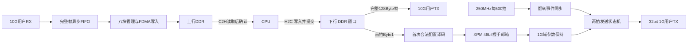

> 历史阶段记录：其中128Byte、2µs跨域定时、TOP不例化IP、未运行仿真的表述已被V2.01替代。当前协议见 `docs/PCIe交互协议_V2.01.md`，验证以本轮实际报告为准。

# 主机新增需求：1G 周期发送与 100ms 八块 DDR 缓存

更新：2026-09-14。协议版本日期保持2026-09-13。工程范围是本地开发副本；原轻量备份保留。本轮不连接远程机，不运行仿真、综合、实现或上板。

## 1. 本轮顶层边界

`TOP.v` 不例化 Aurora 1G 或 10G IP，改为暴露它们的用户接口。保留 PCIe、DDR、时钟、温度及 LED 集成。新增主机业务逻辑，不例化 Buck 模型，不处理子机 output 或模型启停。

1G 用户接口为 **32bit、31.25MHz、高有效握手**，仅业务 TX。10G 保留 64bit 高有效 LocalLink TX/RX。未来物理集成在外层接入单个 1G IP；目前没有引入任何新 Aurora 核，也没有宣称本地旧封装与远端 `_verified` 一致。

- 远端参考：`C:\project\RTDS\aurora_8b10b_1p25g_2020_2_verified`，本轮未读取或修改。
- 本地旧参考：`E:\aurora_proc\rtl\aurora_8b10b_1p25g_design.v`，仅用于理解用户接口历史约定，未例化到本轮 TOP。
- 物理集成时再核对 Duplex 建链连接、REM 语义、字节顺序、GT 管脚、参考时钟及 25MHz 初始化时钟。本轮 TOP 不是已经具备完整引脚的可上板顶层。

## 2. 数据流及 1G 配置



下行窗口保持 `0x8000..0xFFFF`，最多 32KiB。CPU 每次提交长度必须是 128Byte 的正整数倍，起始地址也按 128Byte 对齐，整个范围不得越界。原帧全部透传到 10G；Byte0 及其他字段留给子机解释。

adapter 在首个 DDR 读数据拍被真实接受时提取 `[15:8]`，即 Byte1。解析无需等待 10G 把该帧发送完。现有 TX 启动仍要求链路就绪；掉线期间软件不能把提交成功当作已配置 1G。

| 编号 | duty 十进制，16bit | Vin 电压 | Vin 固定点整数，32bit |
|---|---:|---:|---|
| 1 | 3000 | 5 | `0x00500000` |
| 2 | 5000 | 5 | `0x00500000` |
| 3 | 8000 | 5 | `0x00500000` |
| 4 | 2000 | 12 | `0x00C00000` |
| 5 | 3000 | 12 | `0x00C00000` |
| 6 | 5000 | 12 | `0x00C00000` |
| 7 | 8000 | 12 | `0x00C00000` |
| 8 | 3000 | 24 | `0x01800000` |
| 9 | 5000 | 24 | `0x01800000` |
| 10 | 8000 | 24 | `0x01800000` |

Vin 为电压乘以 1048576。非法编号不启动配置；第一次合法编号后保持至主机逻辑复位，后续配置帧仍继续送 10G。

1G 线上有效载荷为小端 `duty[15:0]` 后跟小端 `Vin[31:0]`，共 6Byte。用户接口当前约定先发字节位于 32bit 数据高位：第一拍放 Byte0..3，SOF=1、REM=3；第二拍高 16bit 放 Byte4..5，EOF=1、REM=1，低 16bit 无效。外部封装必须保持这项映射，不能仅把同名 32bit 总线直接相连就视为端序已验证。

### 周期、反压及复位

- 250MHz 域每 500 拍翻转一个事件位，1G 域用平台 XPM 同步后识别变化；不直接同步 4ns 脉冲。
- 配置通过 XPM 48bit 完整握手传递，不逐 bit 同步。请求、确认完成四相返回；源端保存首次提交标记，阻止第二次配置。
- 31.25MHz 每拍 32ns；周期观察会有 32ns 量化，平均基准为 2us，不根据发送完成时刻重新计时。
- 6Byte/2us 的净载荷为 24Mb/s。两拍是用户接口数据拍数，不包括线路成帧、CRC、时钟补偿等开销。
- 空闲遇到事件开始新帧；忙时跳过重复任务并计数。VALID 已拉高的拍必须保持数据、REM、SOF、EOF，直到 READY 接受。不能为了守住周期撤回一个被反压的拍。
- 链路掉线或用户接口复位可中止未完成帧，保留已配置参数；恢复后吸收历史事件，再从后续周期继续，不补发。
- 主机全局复位清配置和统计。每域使用 FPGA 平台复位同步器，异步置位、四拍同步释放。XPM 握手核没有业务复位端口，因此主机复位期间两域时钟须运行，send/ack 保持低至少各 16 拍，再允许新的配置提交。外部 1G 用户时钟停止时必须同时指示接口复位/链路未就绪。

## 3. 上行 DDR 所有权

生产参数：100ms × 8 块；每块分配 256KiB；上行只有 10G。地址为：

```text
块k第n帧 = 0x00100000 + k * 0x40000 + n * 128
k = 0..7
上行总窗口 = 0x00100000..0x002FFFFF
DDR AXI 映射 = 0x00000000..0x003FFFFF
```

按 50us/帧，100ms 约 2000 帧、256000Byte，低于块容量 262144Byte。容量上限为 2048 帧；超出容量但尚未到封块时间的新帧整帧丢弃。帧长固定 128Byte，当前不支持变长帧。

写状态为 `IDLE → REQ → DATA → RESPONSE → IDLE`。请求后冻结地址和完整帧，16 个写数据拍仅在实际接受时推进。最后一个 W 拍不是完成：CONV_DMA 在最后一个相关 AXI B 响应返回后才输出 `fdma_wdone`，整次请求中任一错误保留在 `fdma_werror`。成功才增加有效长度；错误帧不计入可读范围，后续帧可覆盖这个未成功的槽位。

100ms 到达时只置封块请求；在途帧和响应完成后才发布。空块不发布、不产生中断。完整待取块用读写块号、8 组长度/序号及计数管理；CPU 确认之前，队头地址、长度、序号和数据都不改变。软件释放前，写指针不能覆盖该块。

满队列、块超容量、帧格式错误、接收 FIFO 满或写错误均记录丢帧，按完整帧恢复。接收 FIFO 为 128 个 1024bit 帧槽，约 16KiB，用于短时速率差，不替代 DDR 队列。持续软件处理能力需高于平均 2.56MB/s 并有追赶余量。

**时间边界的实际含义：**本实现按 DDR 写入管理域的窗口封块，在途帧完整结束；未给每个 10G 帧添加到达时间戳。FIFO 内的积压帧可能归入后续写入窗口。若软件要求严格按线路到达时刻分组，需要额外传递时间窗标签；当前需求采用“每100ms提供一批已存完整帧”的约定。

### 录音中的 500ms 与分块选择

录音转写作为需求讨论依据，其中噪声和说话人推断不是可执行指令。最终采用用户确认的 100ms 八块；块周期决定正常等待，块数决定抖动余量。

| 对比 | 500ms 双区 | 100ms 八块 |
|---|---:|---:|
| 每块有效数据，50us/128Byte | 1280000Byte | 256000Byte |
| 每块分配 | 2MiB | 256KiB |
| 总分配 | 4MiB | 2MiB |
| 正常通知 | 2次/秒 | 10次/秒 |
| 空队列起步，首块发布后约可等待复用时间 | 500ms | 700ms |

软件不能仅凭“下一块写完时上一块肯定读完”决定复用；必须显式 ACK。八块相比乒乓主要增加队列元数据、诊断寄存器和积压/回绕验证，不需要通用描述符分配器。此前 1~2 人日的增量估算只用于规划，不包含完整仿真、工具处理和软件联调。

## 4. 寄存器与软件顺序

以下为 INFO_EXCH 内偏移，Root Port 地址映射中该块位于 AXI-Lite `0x40000000`；CPU 侧通过其映射的用户 BAR 访问。

| 偏移 | 含义 | 新约定 |
|---|---|---|
| 0x00 | VERSION | `0x00002000` |
| 0x04 | PROG_TIME | `0x20260913` |
| 0x08 | BUF_LEN_MAX | 上行单块容量 `0x40000`；不是下行最大提交长度 |
| 0x0C | FPGA_TEMP | 保留温度/忙状态 |
| 0x10 | INT_STATE | 读清通知，不释放块 |
| 0x14 | CPU_REC_STATE | 写 0 再写 1，一次释放一个已经呈现的队头 |
| 0x18 | FPGA_CPU_START_ADDR | 最老完整块地址 |
| 0x1C | FPGA_CPU_LEN | 队头实际有效字节数 |
| 0x20 | CPU_WR_DONE | 保留原下行提交与响应生命周期 |
| 0x24/0x28 | CPU_FPGA_START_ADDR/LEN | 下行地址和长度，32KiB窗口、128Byte对齐 |
| 0x2C | DDR_STATUS | 保留原 DDR/错误状态接口 |
| 0x30 | RX_READY_BLOCKS | 只读，完整待取块数 0..8 |
| 0x34 | RX_HEAD_SEQ | 只读，队头批次号 |
| 0x38 | RX_DROPPED_FRAMES | 只读，累计丢帧，32bit 自然回绕 |

软件处理顺序：

1. 收到中断后读取通知及待取块数；读取队头地址、有效长度和批次号。
2. C2H 搬运完整有效范围，等待 DMA **真正完成**。此时不可提前 ACK。
3. 写 0→1 确认释放这个队头。队列非空则重新通知，可直接检查 0x30 继续排空。
4. IRQ 读清与队头发布同拍时，新队头通知优先。空队列的 ACK 不会消费同拍新发布块。

不要求每个128Byte帧单独申请 C2H；软件可按整个块搬运。CONV_DMA 的请求按最多256拍及4KiB边界切分，XDMA 的批量DMA仍由其自身协议处理。两者地址映射均扩大，行为 RAM 索引也随容量扩展，避免仅改地址常量而仍访问同一低64KiB。

## 5. V1.0 与旧代码/旧仿真对照

| 项目 | 旧文档/代码情况 | 本轮源码变化 | 当前验证证据 |
|---|---|---|---|
| 周期与帧长 | 用户背景为50us；V1.0正文另有100us/1KiB表述；旧桥/用例按512Byte | 统一业务帧128Byte，1G单独2us，RX100ms批次 | 新旧参数已区分，尚未运行 |
| 下行地址/长度提交 | 原INFO和adapter已有寄存器流程、多帧计数 | 保留偏移，改对齐、拍数、边界 | 快速用例改128Byte/1KiB/32KiB提交，待运行 |
| 上行缓存 | 原接收帧完成通知/软件ACK，低地址窗口 | 改为8块所有权队列，ACK释放块 | 模块回绕及快速三轮回绕源码，待运行 |
| 中断读清 | 原INFO/adapter已有清通知路径 | 新队头优先；读清不释放块 | 队列定向及Root Port源码，待运行 |
| AXI完成判定 | 原逻辑以数据拍结束为关键事件 | 最终B响应后完成，错误不发布成功长度 | 延迟/错误响应定向源码，待运行 |
| DDR高地址 | 原仿真RAM固定低位索引/64KiB映射 | 4MiB映射与RAM索引、交叉开关译码一起修改 | 八高地址写后统一读回源码，待运行 |
| 真实PCIe事务 | 原Root Port使用真实XDMA/TPI及LL BFM | 保留真实路径，改128Byte/新版本/上行地址/仿真窗口 | 历史日志不代表新版通过 |
| 1G参数周期 | 原主机无本轮首次配置周期发送逻辑 | 新增一次配置邮箱与两拍周期发送 | 十组配置/反压/恢复源码，待运行 |

原备份 logs/reports 中的历史通过标志均不作为本轮验收结论。静态解析只证明语法树可建立、引用/端口名可对应，不能证明 CDC、周期、AXI 协议或数据一致性。

## 6. 后续验证与联板准备

新增 `regression/batch_1g`：

- `tb_rtds_1g.sv`：十组配置、非法/重复配置、异步时钟、6Byte顺序、首/末拍反压、忙时跳过、链路恢复。
- `tb_rtds_ring.sv`：24块回绕、八块积压、禁止覆盖、读清/ACK竞争、延迟写完成、写错误、丢帧恢复、空周期无IRQ。
- `tb_rtds_axi.sv`：实际CONV_DMA和4MiB RAM、AW/W独立停顿、末拍保持、B延迟/错误、八块高地址不别名、跨4KiB的长请求。
- `tb_rtds_rx_fifo.sv`：完整帧FIFO满载、排空、短帧/中断计数与恢复。
- 现有 `sim_xdma_trythrough` 已改为新版快速功能路径；现有 `sim_xdma_rootport` 保留真实XDMA路径并改为新版冒烟入口。

生产100ms不变；模块/快速/Root Port测试各自显式缩短窗口以降低运行时间，不能把这些加速参数复制到生产实例。仿真入口为 `run_later.tcl`，必须显式选择用例，当前没有执行。

暂不新增常驻生产逻辑的“联板测试模块”。已有软件BAR/DMA操作、调试状态和用户接口足够开展第一阶段联调。必要时在未来板级封装增加 ILA 探针，按原生时钟分别观察，不为测试额外建立一条业务数据路径。

联板观察顺序：DDR校准完成 → PCIe链路/版本 → 下行配置提交 → 10G原帧 → 1G已配置编号/两拍握手 → 100ms块发布 → C2H实际完成 → ACK后队头推进。积压试验通过延迟软件ACK完成；检查0x30和0x38，恢复后排空。先正常下行，再做反压/掉线，不以未完成DMA提前ACK制造数据损坏。

关于口述的“防抖”：本次主机业务路径中未找到独立按键消抖模块。复位同步、CDC与仿真BFM是不同用途；本轮按前仿/联板验证准备处理，没有新增按键滤波延时或改变外部按键行为。

待运行的扩展验收还包括满速多帧窗口边界、FIFO压力/畸形帧、CPU并发DMA积压排空及真实Root Port批量跨页。定向用例覆盖的层级不能替代这些集成场景。

## 7. 代码规范与交付状态

规范来源：`E:\centOS\代码规则建立\代码规范输出` 的01、02和03文档及配置JSON。新增设计采用Verilog，验证采用SystemVerilog；声明与assign分离，新增核心时序按单寄存器拆分，配置LUT共同分支的组合例外在源码注明。端口、寄存器和协议段添加中文语义说明。

FPGA技术相关CDC集中于 `rtds_fpga_*` 平台文件，完整帧FIFO在接收平台包装层使用XPM。全局批准单元表仍为TBD，本轮没有擅自把其状态改成approved；本交付不构成ASIC规范签核。保留的历史接口名称、厂商生成代码和旧验证BFM风格须与新写业务代码区别审查。具体静态结果见 `reports/batch_static_parse.json`、`reports/batch_project_audit.json`，后续Vivado重新生成BD并检查后再运行测试。

## 8. 板上DDR与BRAM取舍

沿用历史DDR集成：64bit物理数据总线、AXI64bit数据/32bit地址/5bit ID、共享100MHz输入及既有MIG和AXI时钟转换器。本轮不改变板级器件选择、MIG时序或引脚。历史记录中的国产DDR颗粒与MIG所用Micron兼容配置并非已经完成本轮实板验证。

按常规64bit组织，256KiB约需64个36Kb BRAM；原100ms双区约128个，本次2MiB八块约512个，占KU040共600个的85.3%，会挤压PCIe/FIFO等资源。本轮继续使用DDR；该数值是组织估算，不是综合利用率报告。
