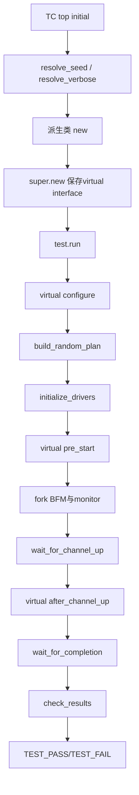

# fdma_aurora_brg 仿真结构与测试用例说明

<!-- 文档导读：该文档说明仿真结构、回归策略和测试用例。 -->

## 1. 验证目标

<!-- 本节围绕“1. 验证目标”展开，阅读时可结合对应 RTL/testbench 的同名模块或任务。 -->

本平台验证FDMA与Aurora LocalLink转换桥的基本功能和关键握手可靠性。默认帧长为
512B，即64个64-bit数据字，恰好对应一个512B FDMA突发。验证重点是数据顺序、
地址推进、帧边界、反压保持、FIFO水线和满载保护；不引入UVM。

## 2. 目录与编译关系

<!-- 本节围绕“2. 目录与编译关系”展开，阅读时可结合对应 RTL/testbench 的同名模块或任务。 -->

```text
new/
  fdma_aurora_brg_tx.v             TX RTL，FRAME_BYTES默认512
  fdma_aurora_brg_rx.v             RX RTL
  fdma_aurora_brg_top.v            桥接top，FRAME_BYTES默认512
  fdma_aurora_brg_aurora_loop.v    Aurora集成wrapper，FRAME_BYTES默认512
  harness/
    aurora_loop_harness.sv          Aurora核和GT环回
    brg_harness.sv                  直接例化桥接top，可控LL注入
  tc/
    tc_if.sv                        公共interface和观察信号
    tc_base.sv                      BFM、随机计划、scoreboard和公共配置
    tc_<name>.sv                    独立派生类和tc_<name>_top
    tc_list                         合法用例注册表
regression/
  regress_list                      用户回归配置
  run_regression.ps1               解析配置、生成seed和汇总
  run_regression.tcl               Vivado/XSim单次执行引擎
```

编译顺序为`tc_if.sv -> tc_base.sv -> harness -> 独立TC`。回归脚本从`tc_list`
读取全部用例并将选中用例的`${tc_name}_top`设置为仿真top，因此新增用例不需要修改
脚本中的case或映射表。

## 3. 数据流与scoreboard

<!-- 本节围绕“3. 数据流与scoreboard”展开，阅读时可结合对应 RTL/testbench 的同名模块或任务。 -->

数据依次经过以下边界，每个边界都保存独立队列：

```text
expected
  -> FDMA read handshake
  -> TX FIFO write
  -> TX FIFO read
  -> LL TX handshake
  -> LL RX handshake
  -> RX FIFO write
  -> RX FIFO read
  -> FDMA write handshake
```

仿真结束时逐级比较队列长度和内容。日志打印每组队列的长度、首字、末字和首个
失配位置。地址参考模型固定为：

```text
0x000 -> 0x200 -> 0x400 -> ... -> 0xE00 -> 0x000
```

SOF只能出现在每帧第0字，EOF只能出现在第63字，末字REM必须为`3'b111`。

## 4. 公共随机延迟配置

<!-- 本节围绕“4. 公共随机延迟配置”展开，阅读时可结合对应 RTL/testbench 的同名模块或任务。 -->

所有可调延迟集中在`tc/tc_base.sv`开头的
`USER-CONFIGURABLE RANDOM DELAY PARAMETERS`区。单位均为`fdma_clk`周期；
min/max是闭区间，prob范围为0～100。

| 配置 | 协议阶段 | 默认范围/概率 |
|---|---|---|
| `cfg_rd_accept_delay_*` | rareq出现到BFM拉高rbusy | 1～8，30% |
| `cfg_wr_accept_delay_*` | wareq出现到BFM拉高wbusy | 1～8，30% |
| `cfg_rd_inter_burst_gap_*` | 读末字后保持rbusy的额外周期 | 1～8，30% |
| `cfg_wr_inter_burst_gap_*` | 写末字后保持wbusy的额外周期 | 1～8，30% |
| `cfg_rd_valid_gap_*` | 读突发内某数据字前rvalid空拍 | 1～4，20% |
| `cfg_wr_ready_stall_*` | 写突发内某数据字的wready低周期 | 1～4，20% |

`prob=0`或`enable_backpressure=0`会禁用对应随机延迟。派生TC可在`configure()`
覆盖这些公共字段。每次运行都会打印配置范围、概率、各帧实际延迟及每个非零数据停顿。

## 5. Seed、日志和打印等级

<!-- 本节围绕“5. Seed、日志和打印等级”展开，阅读时可结合对应 RTL/testbench 的同名模块或任务。 -->

- seed是`000001`～`999999`范围内的六位十进制数。
- 回归脚本保证同一轮回归不重复seed。
- GUI未给`+SEED`时，TC自动选择seed并首先打印`[RANDOM]`行。
- 复现时使用`-testplusarg SEED=038241`。
- `VERBOSE=0`只打印配置摘要、错误和结果。
- `VERBOSE=1`额外打印随机计划、帧首尾字、地址和队列摘要，默认采用此级别。
- `VERBOSE=2`逐字打印FDMA刺激、写回数据和关键握手，适合单用例调试。

关键输出会同时出现在Vivado Tcl Console和`simulate.log`。发生错误时，首先搜索
`TEST_FAIL`和`first mismatch`，再使用相同seed和`VERBOSE=2`复现。

## 6. 测试用例

<!-- 本节围绕“6. 测试用例”展开，阅读时可结合对应 RTL/testbench 的同名模块或任务。 -->

### 6.1 tc_aurora_loop_nobp

<!-- 本节围绕“6.1 tc_aurora_loop_nobp”展开，阅读时可结合对应 RTL/testbench 的同名模块或任务。 -->

**激励顺序**

1. Aurora harness产生时钟和复位，等待GT环回链路`channel_up`。
2. 随机产生1～3帧，每帧64个随机64-bit数据字。
3. BFM在`rareq`后立即拉高`rbusy`，连续给出64个`rvalid`数据字。
4. TX生成SOF/EOF并通过Aurora核和GT环回返回RX。
5. 写BFM立即响应`wareq`并保持`wready=1`接收64字。

**预期结果**

- 所有边界队列长度均为`帧数*64`且内容一致。
- 每帧恰好64次LL握手；SOF、EOF和REM正确。
- 读写地址从0开始按0x200推进。
- FIFO无overflow、underflow和X/Z。

**可能错误及分析**

- `channel_up timeout`：检查GT参考时钟、sys_rst和Aurora仿真参数。
- 第一字或末字失配：检查FWFT FIFO读时序、SOF状态切换和计数初值。
- LL队列长度差1：重点观察`tx_src_rdy/tx_dst_rdy`及EOF周期。

### 6.2 tc_aurora_loop_bp

<!-- 本节围绕“6.2 tc_aurora_loop_bp”展开，阅读时可结合对应 RTL/testbench 的同名模块或任务。 -->

**激励顺序**

1. 完成与NOBP相同的链路初始化和1～3帧随机数据生成。
2. 按公共配置随机延迟rbusy/wbusy响应。
3. 在读突发内随机插入rvalid空拍。
4. 在写突发随机位置拉低wready，并检查停顿期间数据保持。
5. 在突发末尾按随机间隔延迟busy撤销，再允许下一请求。

**预期结果**

- 计数器、FIFO和scoreboard只在真实握手时推进。
- wready低期间wvalid保持，wdata不得变化。
- rvalid空拍不得产生TX FIFO写入。
- 最终数据、地址和帧标记与NOBP相同。

**可能错误及分析**

- 停顿后重复或丢字：检查FIFO读使能是否由valid/ready共同限定。
- 最后一字停顿后提前结束：检查burst_done是否使用真实握手。
- 地址过早推进：检查地址更新是否发生在busy完整撤销之后。

### 6.3 tc_aurora_loop_addr_wrap

<!-- 本节围绕“6.3 tc_aurora_loop_addr_wrap”展开，阅读时可结合对应 RTL/testbench 的同名模块或任务。 -->

**激励顺序**

1. 随机运行9～12帧，不注入普通反压。
2. 逐帧记录FDMA读写请求地址。
3. 第8个突发使用0xE00，下一突发必须回到0。
4. 回绕前后继续执行完整Aurora数据环回和scoreboard比较。

**预期结果**

- 地址序列严格符合参考模型，至少发生一次4KB回绕。
- 回绕后的数据仍与原随机数据一致，不得与地址0的早期帧混淆。

**可能错误及分析**

- 回绕到0x1000：检查`addr + 512 >= 4096`条件。
- 读写地址不同步：分别检查TX和RX状态机完成条件。
- 回绕后数据错位：检查scoreboard索引而非仅按地址覆盖存储。

### 6.4 tc_brg_rd_ready_stall

<!-- 本节围绕“6.4 tc_brg_rd_ready_stall”展开，阅读时可结合对应 RTL/testbench 的同名模块或任务。 -->

**激励顺序**

1. 使用直接bridge harness，随机运行1～3帧。
2. 随机选择非边界数据字和2～5个停顿周期。
3. 通过验证控制强制TX FIFO almost_full，使`fdma_rready=0`。
4. BFM保持rvalid和rdata，逐周期观察计数器及FIFO写使能。
5. 解除强制并完成剩余传输。

**预期结果**

- rready低期间`rd_word_cnt`保持不变，TX FIFO不得写入。
- 恢复后被保持的数据只接收一次。

**可能错误及分析**

- 当前RTL若仅以rvalid推进`rd_word_cnt`，会立即报告计数器错误。
- burst最后一字附近可能提前进入RD_WAIT；观察`rd_burst_done`。
- 该用例定位RTL缺陷，不会自动修复RTL。

### 6.5 tc_brg_wr_ready_stall

<!-- 本节围绕“6.5 tc_brg_wr_ready_stall”展开，阅读时可结合对应 RTL/testbench 的同名模块或任务。 -->

**激励顺序**

1. 在全部写回数据的早段、中段和末段各随机选择一个字。
2. 分别拉低wready 2～8个周期。
3. 每周期检查wvalid和wdata稳定性。
4. 恢复wready后检查当前字只握手一次，并完成整帧。

**预期结果**

- wready低期间wdata/wvalid稳定，RX FIFO不得多读。
- 末字只有在wready恢复并握手后才结束突发。

**可能错误及分析**

- 数据变化：检查`wdata_hold`寄存器及预取条件。
- RX FIFO多弹一个字：检查`fifo_rd_en`是否由w_hs限定。
- 最后一字丢失：检查`w_last_hs`和跨突发预取保护。

### 6.6 tc_brg_tx_fifo_waterline

<!-- 本节围绕“6.6 tc_brg_tx_fifo_waterline”展开，阅读时可结合对应 RTL/testbench 的同名模块或任务。 -->

**激励顺序**

1. 使用直接bridge harness并准备8帧、共512个随机字。
2. 在数据到达前拉低`tx_dst_rdy`，禁止TX FIFO排空。
3. FDMA读BFM持续供数，等待FIFO达到448字almost_full水线。
4. 检查rready、full、overflow和写计数。
5. 拉高`tx_dst_rdy`排空FIFO，随后完成RX和FDMA写回比较。

**预期结果**

- 448字附近almost_full拉高，`fdma_rready`拉低。
- FIFO不得越过512字或产生overflow。
- 解除阻塞后全部数据按原顺序排空并写回。

**可能错误及分析**

- 水线未到而读侧停止：检查XPM计数跨时钟同步和阈值配置。
- 水线后仍写入：检查rready传播和FDMA握手限定。
- 排空首字错位：检查FWFT模式下dout与rd_en关系。

### 6.7 tc_brg_rx_fifo_overflow

<!-- 本节围绕“6.7 tc_brg_rx_fifo_overflow”展开，阅读时可结合对应 RTL/testbench 的同名模块或任务。 -->

**激励顺序**

1. 关闭TX到RX自动环回，启用TC直接RX注入。
2. 保持wbusy为0，禁止FDMA写侧排空RX FIFO。
3. 注入`2048 + 随机1～64`个随机数据字并保持rx_src_rdy。
4. 观察2032字水线、full、wr_en和rx_dst_rdy。
5. 记录第一个“LL已握手但FIFO未写入”的数据字。

**预期结果**

- 2032字附近almost_full、容量边界处full必须被观察到。
- 如果full后rx_dst_rdy仍为1且wr_en为0，数据已被协议接受但丢失，判定FAIL。
- 日志打印首个丢失字序号、数据、FIFO计数和full状态。

**可能错误及分析**

- 预期的当前RTL风险是`rx_dst_rdy=1'b1`且写使能被`!fifo_full`屏蔽。
- XPM overflow不一定拉高，因为RTL在full时禁止wr_en；不能只依赖overflow标志判断丢数。
- 若水线未观察到，检查XPM复位忙、直接注入mux和写时钟。

## 7. 回归配置与输出

<!-- 本节围绕“7. 回归配置与输出”展开，阅读时可结合对应 RTL/testbench 的同名模块或任务。 -->

`regression/regress_list`每行格式为：

```text
testcase  repeat_count  wave
```

`wave=0`不保存WDB，`wave=1`保存完整WDB。脚本生成：

- `regress_log.log`：每次运行一行，包含状态、TC、轮次、seed、波形、耗时和路径。
- `regress_rpt.log`：按TC统计TOTAL/PASS/FAIL并给出总体结果。
- `<tc>_<seed>_simulate.log`：XSim详细日志。
- `<tc>_<seed>_behav.wdb`：开启波形时的数据库。

## 8. SystemVerilog语法、依赖关系与运行时调用

<!-- 本节围绕“8. SystemVerilog语法、依赖关系与运行时调用”展开，阅读时可结合对应 RTL/testbench 的同名模块或任务。 -->

### 8.1 为什么不再只有一个传统TB文件

<!-- 本节围绕“8.1 为什么不再只有一个传统TB文件”展开，阅读时可结合对应 RTL/testbench 的同名模块或任务。 -->

传统TB通常把DUT例化、时钟复位、激励、监视和结果比较全部写在一个`module`中。
本平台只是把这些职责拆开，Vivado最终仍然只需要一个真正的仿真top：
`${tc_name}_top`。其余文件都是这个top直接或间接依赖的类型、模块和package。

| 组成 | 语法类型 | 创建时间 | 作用 |
|---|---|---|---|
| `${tc_name}_top` | `module` | elaboration | Vivado设置的唯一仿真top |
| harness | `module` | elaboration | 例化DUT、interface、时钟和复位 |
| `tc_if.sv` | `interface`定义 | elaboration | 把一组协议线组合成可传递对象 |
| `tc_base` | `class` | 仿真运行时 | 公共BFM、monitor、scoreboard和随机计划 |
| 派生TC class | `class extends` | 仿真运行时 | 覆盖某个用例特有的配置或hook |
| package | `package` | compile | 保存可被`import`的常量、函数和class类型 |

模块和interface属于静态层次，XSim在仿真启动前完成例化；class对象不形成硬件层次，
而是在top的`initial`块执行到`new(...)`时才建立。

### 8.2 编译依赖

<!-- 本节围绕“8.2 编译依赖”展开，阅读时可结合对应 RTL/testbench 的同名模块或任务。 -->

```text
tc_if.sv
  ↓ 定义fdma_read_if/fdma_write_if/ll_link_if/brg_ctrl_if/brg_obs_if
tc_base.sv
  ↓ package中声明tc_base，构造函数使用上述virtual interface类型
tc_<name>.sv
  ↓ import公共package，声明“extends tc_base”的派生类
harness/*.sv
  ↓ 静态例化interface和DUT
tc_<name>_top
  ↓ 静态例化harness，运行时new派生类
```

`import fdma_aurora_brg_tb_pkg::*;`只是在当前作用域开放公共package中的名字，
不会创建对象。`extends tc_base`表示派生类继承base中的字段和task。
派生构造函数里的`super.new(...)`先初始化base部分，并保存从harness传来的
virtual interface句柄。

例如：

```systemverilog
aurora_loop_harness h();
tc_aurora_loop_bp test;
test = new(seed, verbose, h.rd_if, h.wr_if, h.ll_if, h.ctrl_if, h.obs_if);
test.run();
```

- `h()`在elaboration阶段建立DUT和真实interface实例。
- `test`只是class句柄，声明时还没有对象。
- `new(...)`建立对象，并让class通过virtual interface访问`h`中的真实信号。
- `test.run()`进入base公共流程；其中调用的virtual方法会自动跳到派生类实现。

### 8.3 virtual方法如何调用

<!-- 本节围绕“8.3 virtual方法如何调用”展开，阅读时可结合对应 RTL/testbench 的同名模块或任务。 -->

base的公共`run()`按以下顺序执行：



- NOBP/BP/地址回绕主要覆盖`configure()`。
- 写反压用例覆盖`apply_directed_plan()`。
- 读ready停顿覆盖`on_read_word_presented()`。
- TX水线覆盖`pre_start()`和`after_channel_up()`。
- RX溢出流程不同，直接覆盖整个`run()`。

`fork ... join_none`并发运行读BFM、写BFM、FDMA monitor和LL monitor；base在完成或
超时后设置`stop_requested`并执行`disable fork`结束这些后台线程。

## 9. Vivado如何识别这套平台

<!-- 本节围绕“9. Vivado如何识别这套平台”展开，阅读时可结合对应 RTL/testbench 的同名模块或任务。 -->

### 9.1 当前XPR已经配置好的内容

<!-- 本节围绕“9.1 当前XPR已经配置好的内容”展开，阅读时可结合对应 RTL/testbench 的同名模块或任务。 -->

`fdma_aurora_brg.xpr`的`sim_1` fileset已经包含：

1. `tc/tc_if.sv`
2. `tc/tc_base.sv`
3. 两个harness
4. 七个独立TC文件

默认Simulation Top为`tc_aurora_loop_nobp_top`。因此打开当前XPR后，不需要手工
include或拼接文件；在Vivado的Sources窗口展开`Simulation Sources`，右键希望运行的
`${tc_name}_top`选择`Set as Top`，然后点击`Run Behavioral Simulation`即可。

也可以在Vivado Tcl Console中执行随工程提供的配置脚本：

```tcl
source {E:/gpt_doc/fdma_aurora_brg/fdma_aurora_brg.srcs/sources_1 - loop_validate/regression/setup_vivado_sim.tcl}
```

默认选择NOBP；从命令行启动Vivado时可传TC名称：

```powershell
vivado -mode gui -source setup_vivado_sim.tcl -tclargs tc_aurora_loop_bp
```

修改top后建议在Tcl Console执行：

```tcl
update_compile_order -fileset sim_1
set_property top tc_aurora_loop_bp_top [get_filesets sim_1]
launch_simulation -mode behavioral
run all
```

### 9.2 在一个全新Vivado工程中手工加入

<!-- 本节围绕“9.2 在一个全新Vivado工程中手工加入”展开，阅读时可结合对应 RTL/testbench 的同名模块或任务。 -->

GUI步骤：

1. `Add Sources -> Add or Create Simulation Sources`。
2. 加入`tc_if.sv`、`tc_base.sv`、两个harness和需要的TC文件。
3. 确认`.sv`文件类型为`SystemVerilog`且`Used In Simulation`有效。
4. 将`${tc_name}_top`设置为Simulation Top，而不是把class或harness设为top。
5. 确保DUT RTL、Aurora XCI及其simulation output products也在工程中。

等价Tcl示例：

```tcl
add_files -norecurse -fileset sim_1 [list \
  new/tc/tc_if.sv \
  new/tc/tc_base.sv \
  new/harness/aurora_loop_harness.sv \
  new/harness/brg_harness.sv \
  new/tc/tc_aurora_loop_bp.sv]
set_property file_type SystemVerilog [get_files -of_objects [get_filesets sim_1] *.sv]
set_property top tc_aurora_loop_bp_top [get_filesets sim_1]
update_compile_order -fileset sim_1
launch_simulation -mode behavioral
run all
```

只运行bridge定向测试时选择`tc_brg_*_top`，它会例化`brg_harness`；完整Aurora测试
选择`tc_aurora_loop_*_top`，它会例化`aurora_loop_harness`。

## 10. ENABLE_ILA宏

<!-- 本节围绕“10. ENABLE_ILA宏”展开，阅读时可结合对应 RTL/testbench 的同名模块或任务。 -->

`ENABLE_ILA`不是parameter，而是Verilog预处理宏。`` `ifdef ENABLE_ILA``中的代码在
编译前根据宏是否存在决定保留或删除。

当前状态：

- 宏没有在源码、XPR或Tcl中定义，因此ILA例化默认不参与编译。
- 宏在`fdma_aurora_brg_aurora_loop.v`和`ila_brg_loop.v`中使用。
- XPR虽然包含`ila_top.xci`，但`ila_brg_loop.v`实际引用的是`ila_fdma`和`ila_user`。
- 当前工程没有`ila_fdma`、`ila_user`模块，`ila_brg_loop.v`也未加入sources_1。
- 所以当前不要定义`ENABLE_ILA`；行为仿真使用WDB观察信号即可。

未来确实需要上板ILA时，应先生成名称和probe完全匹配的`ila_fdma`、`ila_user` IP，
将`ila_brg_loop.v`及两个XCI加入`sources_1`，再定义宏：

```tcl
set_property verilog_define {ENABLE_ILA} [get_filesets sources_1]
set_property verilog_define {ENABLE_ILA} [get_filesets sim_1]
```

取消宏：

```tcl
set_property verilog_define {} [get_filesets sources_1]
set_property verilog_define {} [get_filesets sim_1]
```

Vivado GUI中的对应入口是`Project Settings -> Verilog Options -> Verilog define`。

## 11. Vivado/XSim使用

<!-- 本节围绕“11. Vivado/XSim使用”展开，阅读时可结合对应 RTL/testbench 的同名模块或任务。 -->

### 11.1 PowerShell批量回归

<!-- 本节围绕“11.1 PowerShell批量回归”展开，阅读时可结合对应 RTL/testbench 的同名模块或任务。 -->

从Vivado Command Prompt启动PowerShell，进入`regression`目录：

```powershell
.\run_regression.ps1 -RegressList .\regress_list
```

若Windows执行策略阻止`.ps1`，使用：

```powershell
powershell -ExecutionPolicy Bypass -File .\run_regression.ps1 -RegressList .\regress_list
```

若Vivado不在PATH，可使用`-Vivado D:\Xilinx\Vivado\2020.2\bin\vivado.bat`。

### 11.2 Vivado GUI/Tcl Console

<!-- 本节围绕“11.2 Vivado GUI/Tcl Console”展开，阅读时可结合对应 RTL/testbench 的同名模块或任务。 -->

```tcl
open_project E:/gpt_doc/fdma_aurora_brg/fdma_aurora_brg.xpr
set_property top tc_aurora_loop_bp_top [get_filesets sim_1]
set_property xsim.simulate.xsim.more_options \
  "-testplusarg VERBOSE=2" [get_filesets sim_1]
set_property xsim.simulate.log_all_signals true [get_filesets sim_1]
launch_simulation -mode behavioral
run all
```

未指定seed时，Tcl Console会打印自动seed。复现时关闭当前仿真并加入：

```tcl
-testplusarg SEED=038241 -testplusarg VERBOSE=2
```

### 11.3 与VCS/Verdi流程对照

<!-- 本节围绕“11.3 与VCS/Verdi流程对照”展开，阅读时可结合对应 RTL/testbench 的同名模块或任务。 -->

| VCS/Verdi | Vivado/XSim |
|---|---|
| `vcs`编译和elaborate | `launch_simulation`调用xvlog/xelab |
| 仿真可执行文件 | XSim snapshot |
| `+SEED=` | `-testplusarg SEED=` |
| FSDB | WDB |
| Verdi波形窗口 | Vivado Waveform窗口 |
| 批处理脚本 | `vivado -mode batch -source *.tcl` |

WDB可在Vivado中通过`open_wave_database <path>`打开。调试时建议先用日志确定首个错误
边界，再查看该边界前后若干周期，避免一次展开全部层级。
