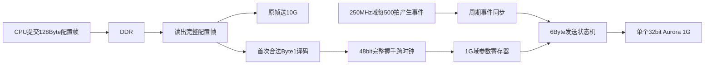

# 本地工程修改计划：1G 周期发送与上行 DDR 八块缓存

## 1. 确定方案与执行范围

- 基于已检查完整的[本地轻量备份](E:/PCIE-CPU/RTDS_test_DDR4_64bit_本机备份_20260820/RTDS_test_DDR4_64bit.xpr)，建立独立开发目录 `E:\PCIE-CPU\RTDS_test_DDR4_64bit_本地开发`，保留原备份。
- 主机只新增一个 **32bit Aurora 1G 实例**。1G 只做业务下行；不例化 Buck 模型，不处理其输出或启停信号。
- 下行：CPU 的128Byte配置帧原样送10G；Byte1首次译码后，1G独立周期发送6Byte参数。
- 上行：只接收10G，采用已确认的 **100ms × 8块循环缓存**。
- 本次实施完成代码、工程引用、验证源码和说明文档；只做静态检查，仿真延后，不运行综合、实现或上板。暂不连接、同步远程机。

当前仍为计划模式；以下修改在切换到执行模式后实施。

## 2. 1G 配置、周期与跨时钟

**31.25MHz 完全能够发送这6Byte数据，IP本身不需要提供2µs定时器。** 每拍32ns，6Byte需要两个32bit有效数据拍；每2µs发送6Byte，业务负载仅24Mb/s。实际发送还包含成帧、CRC和时钟补偿开销，不能把两拍等同于线路总耗时。[Aurora发送接口](https://docs.amd.com/r/en-US/pg046-aurora-8b10b/Transmitting-Data)

实施数据流：

- CPU完成DDR写入并提交命令后，FPGA读取帧；提取Byte1，即小端数据中的 `[15:8]`，解析不依赖10G发送完成。
- 将编号1～10按Buck文档映射为 `duty[15:0]`、`Vin[31:0]`；`Vin`使用电压乘以1048576的定点整数。
- 首次合法配置锁存至主机逻辑复位。后续配置帧继续走10G，但不改变已锁存的1G参数；非法编号不启动1G发送。
- 48bit参数通过完整握手跨时钟，禁止逐bit独立同步。仅同步一次配置，周期发送不重复读DDR。[XPM握手同步器](https://docs.amd.com/api/khub/documents/jmiFdx9l8KRrBT6exVnb1Q/content)
- 1G载荷固定为：Byte0～1是小端 `duty`，Byte2～5是小端 `Vin`。按现有封装的有效字节位置装配两拍，第二拍仅2Byte有效并结束帧。
- 250MHz域每500拍产生一次周期事件，采用翻转事件同步到1G域，不能直接同步4ns脉冲。周期启动于配置传递完成之后。
- 1G发送时刻受32ns时钟粒度限制，因此不承诺每次线路发送恰好间隔2000ns；周期基准保持2µs、不累计漂移。
- 空闲时响应周期事件；忙时跳过新的重复发送任务，不补发、不排长队。已拉高有效信号的拍必须保持至握手完成。
- 链路掉线时停止新发送并清理未完成帧；保留已配置参数，重新建立链路后恢复周期发送，不补发停机期间的数据。
- 保留1G IP的既有Duplex配置和建链所需物理连接，业务RX输出不进入DDR。按其配置提供25MHz初始化时钟。

## 3. 上行 DDR：100ms × 8块

录音中的核心顾虑是软件响应抖动。**块周期决定数据等待多久才能读取，块数量决定能吸收多少积压，两者应独立设计。**

| 项目 | 500ms双区乒乓 | 本次100ms八块 |
|---|---:|---:|
| 每块帧数，按50µs/帧 | 10,000 | 2,000 |
| 每块有效数据 | 1,280,000Byte | 256,000Byte |
| 每块分配空间 | 2MiB | 256KiB |
| 总分配空间 | 4MiB | 2MiB |
| 正常通知频率 | 2次/秒 | 10次/秒 |
| 空缓存起步，首块发布后的复用余量 | 约500ms | 约700ms |

八块方案更早提供数据，也能吸收更长的短时停顿。上述余量包括软件响应和DMA读取时间；有积压时会减少，不能保证软件无限停顿仍不丢数据。

**地址和存取规则：**

- 保留下行窗口 `0x00008000～0x0000FFFF`，容量32KiB。
- 上行窗口使用 `0x00100000～0x002FFFFF`，划分8个256KiB块。
- 第 `k` 块第 `n` 帧地址为 `0x00100000 + k×0x40000 + n×128`。
- XDMA和CONV_DMA的DDR映射扩展为低4MiB；仿真RAM容量、索引位宽一起扩展，消除当前 `[15:3]` 截断造成的高地址别名。
- 每100ms封存一块，记录实际完整帧长度；不等256KiB写满才封存。定时边界遇到在途帧，完成该帧及写响应后再封存，不拆帧。
- 只有最后一个相关AXI写响应成功返回，才能向CPU发布该块。修正当前在末个数据拍就产生完成通知的问题。
- CPU按先后顺序读取完整块；读取期间该块内容、地址和长度保持不变。
- 空周期不产生数据中断。超容量、队列满或异常时，不覆盖未读块；继续接收并按完整帧丢弃新数据，记录丢帧。
- 软件释放空间后，从后续完整帧恢复记录；持续处理能力必须大于平均2.56MB/s，并有追赶积压的余量。

只维护8个块的状态和长度、读写块号及计数，不引入动态内存分配或通用描述符链表。

## 4. PCIe接口与代码改动

保留现有软件基本流程：

**中断 → 读取地址/长度 → C2H搬运 → 写读完确认 → 获取下一块。**

- `0x18/0x1C`：呈现最老完整块的地址和有效长度，保持至CPU确认。
- `0x14 CPU_REC_STATE`：保留0→1确认方式，一次确认释放一个块。
- `0x10 INT_STATE`：读清只清通知，不释放数据；确认后若还有完整块，重新通知，处理同拍清除与新事件竞争。
- `0x08 BUF_LEN_MAX`：更新为上行单块容量256KiB；下行仍限制32KiB，在新版协议说明中明确区分，并更新版本号。
- 新增3个只读寄存器：`0x30`完整待取块数、`0x34`当前呈现块的批次序号、`0x38`累计丢帧数。
- 下行提交寄存器偏移保持不变；将128Byte帧长贯穿地址检查、FDMA长度、计数和帧边界逻辑。

修改集中在发送/接收桥、adapter、CONV_DMA、寄存器模块、TOP/PCIe集成及DDR仿真模型。新增1G配置译码、跨时钟及周期发送模块和上行块管理模块，关键寄存器及握手信号添加中文解释。

本地1G封装早于远程 `_verified` 版本，实施时统一接口并记录来源；远程恢复后再比对，不声称两份版本完全一致。

相较双区乒乓，八块方案主要多出队列管理、状态展示和回绕/积压测试。粗估熟悉工程的工程师增加约1～2人日，属于规划估算；完整仿真、工具问题和软件联调另计。

## 5. 验证与说明文档

本地先检查工程引用、位宽、地址范围、参数一致性和改动清单，编写但暂不运行以下测试：

- 十组配置映射、非法/重复配置、48bit跨时钟一致性、6Byte字节顺序。
- 2µs周期事件、忙时跳过、首拍/末拍反压保持、链路恢复。
- 连续至少三轮八块回绕，逐帧核对数据、地址、长度和顺序。
- 延迟/错误写响应不得提前发布成功块；CPU并发读取时数据不变。
- CPU延迟响应、积压排空、队列满、丢帧计数及恢复。
- 高地址不别名、跨4KiB边界批量DMA、IRQ读清与读完确认竞争。
- 后续分别运行模块前仿和真实XDMA Root Port集成仿真，不用旧512Byte结果代替新需求验收。

新增Markdown文档，包含总体设计、状态与关键时序、寄存器及CPU操作、V1.0需求与当前代码/仿真覆盖对照、录音决策解释和待运行测试清单。

BRAM仅作分析：原100ms双区约需128个36Kb块；本次八块共2MiB，按常规64bit组织约需512个，占KU040全部600个的85.3%，会明显挤压其他模块空间。因此本次继续使用板上DDR，不实施BRAM替代。
